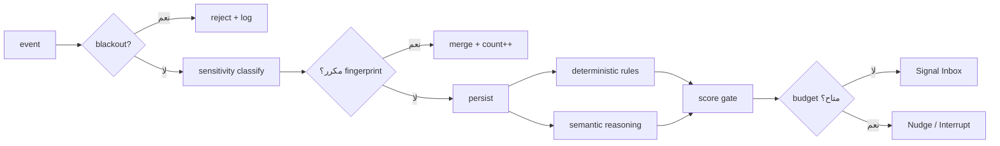

# Event Taxonomy — GONAIM//OS

> **Source:** Master Blueprint §12.1، §29.5، §31
> الـ`events` هي طبقة الحقيقة الخام. كل استنتاج وكل ذاكرة وكل Signal
> يجب أن يشير إلى event واحد على الأقل. **بلا event، لا يوجد ادعاء.**

---

## 1. قاعدة التسمية

```text
<source>.<object>.<verb_past_tense>
```

- `source` — الحاسة: `browser`, `desktop`, `drive`, `gmail`, `telegram`, `github`, `instagram`, `system`, `manual`
- `object` — الشيء: `tab`, `thread`, `file`, `product`, `message`, `subscription`, `memory`
- `verb` — ماضٍ دائمًا: `started`, `changed`, `detected`, `revisited`, `failed`

أمثلة: `browser.intent.started` · `drive.folder.changed` · `memory.contradiction.detected`

**ممنوع:** أسماء بصيغة المضارع أو الأمر. الحدث شيء **وقع**، لا شيء يُطلب.

---

## 2. الغلاف الموحّد

كل event، مهما كان مصدره، يحمل نفس الغلاف:

```jsonc
{
  "id": "evt_01J…",
  "event_type": "chat.thread.project_detected",
  "occurred_at": "2026-08-22T16:12:00+03:00",   // زمن الحدث الحقيقي
  "ingested_at": "2026-08-22T16:12:04+03:00",   // زمن الوصول — قد يختلف
  "source": "browser_companion",
  "source_uri": "https://chatgpt.com/c/…",
  "sensitivity": "private",                      // يُحدَّد عند الاستقبال
  "entities": ["ent_paper_world"],               // ما لمسه الحدث
  "payload": { },                                // مخطط خاص بكل نوع
  "confidence": 0.88,                            // null للأحداث المرصودة مباشرة
  "observed_or_inferred": "observed",            // observed | inferred
  "fingerprint": "sha256:…",                     // منع التكرار
  "session_id": "ses_…",
  "blackout_at_ingest": false
}
```

### قواعد الغلاف

1. **`fingerprint` إلزامي.** = `sha256(event_type + source_uri + occurred_at_minute + payload_hash)`.
   قيد `UNIQUE` — نفس الحدث لا يُسجَّل مرتين مهما تكرر الإرسال.
2. **`occurred_at` ≠ `ingested_at`.** الفرق نفسه إشارة (جهاز كان offline، أو مزامنة متأخرة).
3. **`observed_or_inferred` إلزامي.** خلط الاثنين هو بالضبط "الذاكرة الكاذبة" في §24.3.
4. **`confidence` يكون `null` للأحداث المرصودة.** الملاحظة المباشرة ليست احتمالًا.
5. **`blackout_at_ingest`** يوثق أن الحدث وصل أثناء Blackout — يُرفض ويُسجَّل رفضه.

---

## 3. الفهرس الكامل

### 3.1 المتصفح — `browser.*`

| النوع | متى | Sensitivity | الحمولة الأساسية |
| --- | --- | --- | --- |
| `browser.tab.focused` | تبويب نشط > 8 ثوانٍ | `private` | domain, title, duration_s |
| `browser.intent.started` | نمط تصفح يكشف نية | `private` | intent_kind, confidence, evidence_tabs |
| `browser.product.revisited` | نفس المنتج ≥ 2 مرة | `private` | product_url, revisit_count, price |
| `browser.page.captured` | Capture يدوي | `private` | url, title, user_note |
| `browser.search.repeated` | نفس الاستعلام عبر جلسات | `private` | query_hash, occurrences |
| `browser.session.ended` | خمول أو إغلاق طويل | `private` | duration_s, tabs_touched |

### 3.2 المحادثات — `chat.*`

| النوع | متى | Sensitivity | ملاحظة |
| --- | --- | --- | --- |
| `chat.thread.opened` | فتح thread على allowlist | `private` | العنوان فقط |
| `chat.message.sent` | **بعد** الضغط على Send | `private` | ملخص + entities، **لا نص خام** |
| `chat.thread.project_detected` | ربط thread بمشروع | `private` | inferred، يحمل confidence |
| `chat.thread.attached` | ربط يدوي بـGONAIM//OS | `private` | فعل صريح من المستخدم |

> **القاعدة الحاكمة:** لا يوجد event يُطلق أثناء الكتابة. `chat.message.sent` فقط بعد الإرسال.

### 3.3 الملفات — `drive.*` / `desktop.*`

| النوع | متى | Sensitivity |
| --- | --- | --- |
| `drive.folder.changed` | Drive Changes feed | `private` |
| `drive.file.versioned` | نسخة جديدة لملف متتبَّع | `private` |
| `drive.images.clustered` | CURATOR يجمع صورًا مترابطة | `private` |
| `desktop.file.created` | ملف جديد في Allowlist | `private` |
| `desktop.render.failed` | فشل render | `private` |
| `desktop.version.conflict` | `final_v7` + `final_v7_REAL` | `private` |
| `desktop.backup.missing` | ملف مهم بلا نسخة | `private` |

### 3.4 المال — `money.*`

| النوع | متى | Sensitivity |
| --- | --- | --- |
| `money.subscription.renewal_approaching` | قبل التجديد بمدة | `sensitive` |
| `money.invoice.overdue` | تجاوز المدة المعتادة | `sensitive` |
| `money.payment.failed` | فشل دفع | `sensitive` |
| `money.price.dropped` | انخفاض سعر عنصر مراقَب | `private` |
| `money.credit.underused` | كريدت غير مستهلك قبل التجديد | `sensitive` |

### 3.5 التواصل — `message.*`

| النوع | متى | Sensitivity |
| --- | --- | --- |
| `message.followup_overdue` | رسالة مهمة بلا رد | `sensitive` |
| `message.reply_unread` | رد وصل ولم يُفتح | `sensitive` |
| `message.promise_detected` | وعد أو التزام في نص مسموح | `sensitive` |

### 3.6 الفرص — `opportunity.*`

| النوع | متى | Sensitivity |
| --- | --- | --- |
| `opportunity.match_found` | SCOUT يجد تطابقًا فوق الحد | `private` |
| `opportunity.deadline_approaching` | اقتراب موعد | `private` |
| `opportunity.dismissed` | رفض غنيم — **إشارة تعلّم قوية** | `private` |

### 3.7 النظام والذاكرة — `system.*` / `memory.*`

| النوع | متى | Sensitivity |
| --- | --- | --- |
| `memory.candidate.created` | مرشح دخل الطابور | `private` |
| `memory.contradiction.detected` | تعارض مع ذاكرة قائمة | `private` |
| `memory.corrected` | تصحيح يدوي — **أقوى إشارة تعلّم** | `private` |
| `memory.forgotten` | حذف + إيصال | `private` |
| `system.blackout.activated` | Blackout | `open` |
| `system.permission.changed` | تغيير صلاحية | `open` |
| `system.connector.unhealthy` | connector معطل | `open` |
| `system.action.proposed` | فعل ينتظر موافقة | حسب الفعل |
| `system.action.approved` / `.rejected` | قرار غنيم | حسب الفعل |
| `system.cortex.stayed_silent` | قرر الصمت — **حدث حقيقي وليس غيابًا** | `open` |

### 3.8 اليدوي — `manual.*`

| النوع | ملاحظة |
| --- | --- |
| `manual.capture.created` | نص/صورة/رابط/صوت |
| `manual.state.declared` | "أنا شغال دلوقتي على…" |
| `manual.feedback.given` | Useful / Wrong / Too late / Already knew / Never this type |
| `manual.correction.applied` | تصحيح استنتاج |

---

## 4. أحداث لا توجد ولن توجد

| غير موجود | السبب |
| --- | --- |
| `browser.keystroke.*` | لا keylogging — قاعدة صلبة |
| `person.value.scored` | لا تقييم بشر |
| `health.diagnosis.*` | لا تشخيص |
| `emotion.detected` | المشاعر ليست حقيقة قابلة للرصد |
| `purchase.completed` | لا شراء تلقائي |
| `message.sent_autonomously` | لا إرسال بلا موافقة |

---

## 5. من الحدث إلى الشاشة



**نقطة جوهرية:** المسار له فرعان — `deterministic rules` و`semantic reasoning` (§31.1).
تجديد اشتراك أو فاتورة متأخرة **لا تحتاج نموذجًا**. القاعدة تكفي، وهي أرخص وأدق وقابلة للتفسير.
النموذج يدخل فقط حيث يلزم فهم دلالي: نمط اهتمام، مشروع ناشئ، تناقض، ربط فكرتين.
