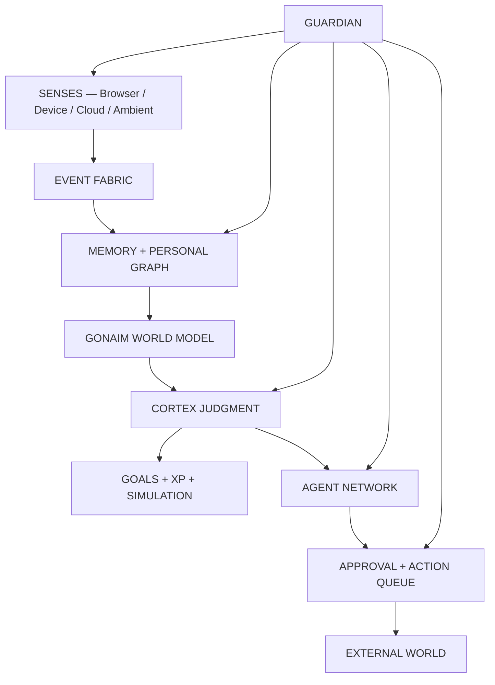

# GONAIM//OS — FUTURE EXPANSION V2

> **The Living Digital Twin / نظام غنيم الحي**  
> **Owner:** Ahmed Gonaim / غنيم  
> **Date:** 2026-08-22  
> **Status:** Long-range product vision — near, medium and far future  
> **Extends:** `GONAIM_OS_MASTER_BLUEPRINT.md`

---

## 0. الحكم من البداية

الفكرة الأقوى ليست أن نبني تطبيقًا يعرف معلومات كثيرة عن غنيم، بل أن نبني **نموذجًا حيًا ومراجعًا لغنيم** يستطيع أن:

1. يرى الإشارات التي سمح له برؤيتها.
2. يتذكر ما حدث ومصدره.
3. يفهم النية الحالية دون ادعاء قراءة العقل.
4. يربط اللحظة بتاريخ غنيم وذوقه وأهدافه وموارده.
5. يقترح حركة واحدة مناسبة في التوقيت الصحيح.
6. ينفذ داخل حدود واضحة وبعد الموافقة المطلوبة.
7. يتعلم من التصحيح والرفض، لا من المراقبة الصامتة فقط.
8. يساعد غنيم على بناء حياة أقرب للشخص الذي يريد أن يصبحه، دون أن يحوله إلى مجموعة أرقام.

الصيغة المستقبلية للمنتج:

> **GONAIM//OS = Living Digital Twin + Personal Memory + Goal Engine + Agent Network + Ambient Interface + Guardian**

هو ليس Dashboard، وليس مساعد صوتي، وليس Habit Tracker، وليس نسخة من Notion. هو **طبقة ذكاء شخصية فوق الحياة الرقمية والواقعية**.

---

## 1. التشبيه الصحيح: أربع شخصيات في نظام واحد

### 1.1 المرآة — MIRROR

تعيد بناء ما حدث فعلًا، وتفصل بين الحقيقة والاستنتاج والفجوة.

### 1.2 المستكشف — SCOUT

يرى الفرص، التغيرات، المخاطر، الأسعار، الرسائل، العلاقات، والأشياء التي ربما فاتت غنيم.

### 1.3 المخرج — CORTEX

يفهم المشهد الكامل ويقرر ما الذي يستحق الظهور الآن، بنفس منطق المخرج الذي يختار اللقطة المهمة ولا يعرض كل الكاميرات دفعة واحدة.

### 1.4 الطاقم — AGENT NETWORK

يبحث، يرتب، يجهز، يلخص، يقارن، يبني Drafts وينفذ الأفعال المسموح بها. لا يتجاوز بوابة الموافقة.

---

## 2. النموذج الرقمي لغنيم — GONAIM MODEL

لا يكفي أن نحفظ Nodes وEvents. النظام يحتاج ست طبقات متزامنة:

| الطبقة | ماذا تحتوي | سرعة التغير |
| --- | --- | --- |
| **IDENTITY** | الاسم، الخلفية، الأدوار، القيم، الحدود، الذوق | بطيئة |
| **STATE** | ما يفعله الآن، المكان، الوقت، التركيز، الضغط المعروف | سريعة جدًا |
| **HISTORY** | أحداث، مشاريع، قرارات، محادثات، ملفات، علاقات | تراكمية |
| **INTENT** | ما يحاول تحقيقه الآن وما بدأ يلمح إليه | متغيرة |
| **RESOURCES** | وقت، مال، أدوات، أجهزة، اشتراكات، علاقات، طاقة | متوسطة |
| **TRAJECTORY** | الاتجاهات والاحتمالات والسيناريوهات | تقديرية |

أي اقتراح من CORTEX يجب أن يوضح أي طبقة استخدم، وما إذا كانت المعلومة مؤكدة أو مستنتجة.

### 2.1 Personal Constitution

وثيقة قصيرة داخل النظام تمثل دستور غنيم الشخصي:

- ما الذي لا يفعله النظام أبدًا؟
- ما الذي لا يضحي به غنيم مقابل المال أو السرعة؟
- ما شكل العمل الذي يشبهه؟
- ما أنواع القرارات التي تحتاج انتظار 24 ساعة؟
- ما المجالات الحساسة التي لا تدخل Cloud؟
- ما معنى النجاح الحالي، وليس النجاح العام؟

هذه الوثيقة أعلى من أي Goal أو Agent. إذا تعارض اقتراح معها، GUARDIAN يوقفه.

---

## 3. خريطة الحياة الكاملة

النظام لا يعرض كل هذه المجالات في الصفحة الرئيسية. يحتفظ بها كعوالم يمكن استدعاؤها حسب السياق.

| العالم | ماذا يفهم | ماذا يستطيع أن يقترح |
| --- | --- | --- |
| **Identity** | الأدوار، القيم، اللغة، الذوق، الحدود | تصحيح تعارض بين قرار وهوية |
| **Creative** | المشاريع، البرومبتات، المراجع، الأخطاء، الاستمرارية | Reference lock، تجربة، Brief، نسخة نهائية |
| **Career** | الخبرة، البورتفوليو، الفرص، الرواتب، المقابلات | فرصة مناسبة، قطعة Portfolio، تفاوض، Follow-up |
| **Money** | السيولة المعلومة، الفواتير، الاشتراكات، الكريدت، الرغبات | تحصيل، إلغاء اشتراك، توقيت شراء، Runway |
| **Learning** | المهارات، المصادر، التجارب، الفجوات | مسار DaVinci أو أداة AI مرتبط بمشروع حقيقي |
| **Focus** | جلسات العمل، المقاطعات، السياق، كلفة التبديل | حماية جلسة، تجميع مهام، إغلاق ضوضاء |
| **Social** | الأشخاص، آخر تواصل، التعاونات، الوعود | تذكير إنساني، Draft رسالة، فرصة تعاون |
| **Communication** | رسائل مهمة، عدم الرد، نبرة التواصل | Follow-up مناسب لا يبدو AI |
| **Possessions** | ما يملكه، حالته، مكانه، ضمانه | صيانة، بيع، استبدال، ربط بشراء جديد |
| **Wants** | Wishlist، تكرار البحث، السعر، الدافع | هل الرغبة مؤقتة؟ هل السعر مناسب؟ |
| **Subscriptions** | التجديد، الاستخدام، الكريدت، البدائل | إلغاء، Downgrade، استغلال قبل التجديد |
| **Media Diet** | ما يشاهده ويحفظه ويعود إليه | كشف اتجاه ذوقي أو تشبع أو مصدر إلهام |
| **Places** | الرياض، القاهرة، السفر، المواقع المهمة | سياق محلي، وقت انتقال، مكان مناسب للعمل |
| **Travel** | الحجوزات، المستندات، الأغراض، الخط الزمني | Checklist ذكية، مخاطر، فرصة مرتبطة بالسفر |
| **Home** | الأجهزة، المساحات، الإضاءة، الضوضاء، الصيانة | Scene للعمل، تنبيه صيانة، وضع هدوء |
| **Digital Estate** | الحسابات، الدومينات، الملفات، النسخ، الصلاحيات | Backup، إلغاء Token، نقل ملكية، أرشفة |
| **Security** | تسريبات، روابط مشبوهة، صلاحيات واسعة | إيقاف، تدوير Secret، Blackout، مراجعة |
| **Reputation** | الوجود العام، البروفايلات، الأعمال المنشورة | فجوة بين المستوى الحقيقي والصورة العامة |
| **Wellbeing** | اختياري ويدوي/من أجهزة مسموحة | نمط طاقة أو نوم، لا تشخيص ولا عقاب |
| **Legacy** | الأعمال والقصص والقرارات التي تستحق البقاء | Time capsule، أرشيف، فيلم حياة، وصية رقمية |

---

## 4. الحواس — كيف يرى النظام الحياة

### 4.1 LENS / Browser

- Domains، URLs، Titles ومدة التركيز في Ambient.
- محتوى الصفحة الحالية عند Focus.
- Allowlist دلالي لمواقع العمل مثل ChatGPT وClaude وDrive وأدوات AI.
- فهم الرسالة بعد إرسالها، لا تسجيل كل حرف.
- اكتشاف Intent مثل: شراء، مقارنة، بناء حملة، بحث عن وظيفة، مشكلة تقنية.

### 4.2 Windows Companion

- التطبيقات المفتوحة والنافذة النشطة.
- مجلدات مختارة فقط.
- تغير الملفات، نسخ جديدة، Render outputs، Missing backups.
- GPU load، مساحة التخزين، فشل Render، تكرار Crash عند الحاجة.
- فتح مشروع أو ملف بعد موافقة، لا التحكم الكامل في الجهاز افتراضيًا.

### 4.3 Mobile Companion

- Capture سريع بالصوت والصورة والرابط.
- مشاركة صفحة إلى GONAIM//OS.
- موقع اختياري بمستويات: City / Area / Exact / Off.
- إشعارات Nudge وInterrupt فقط.
- وضع سفر يجمع التذاكر والموقع والمستندات دون كشفها لبقية الوحدات.

### 4.4 Cloud Senses

- Drive/Photos: metadata، selected folders، OCR، visual embeddings.
- Telegram: Bot أو chats مختارة.
- Email: Labels محددة مثل invoices، contracts، opportunities.
- Calendar: أحداث مختارة وسياق، لا تحويله إلى مدير اليوم كله.
- GitHub/Cloudflare: مشاريع، Deployments، domains، incidents.
- Instagram/LinkedIn: المحتوى العام أو الموصول رسميًا، لا Scraping عدواني.

### 4.5 Physical / Ambient Senses — اختيارية

- Wearable: نوم، حركة، نبض أو Stress proxy ضمن حدود الجهاز.
- Headphones: وضع التركيز، الضوضاء، الجلسات.
- Smart home: إضاءة، حرارة، ضوضاء، جودة هواء.
- Camera/microphone: لا مراقبة دائمة؛ جلسات صريحة فقط مثل Room Scan أو Voice Capture.
- Car/location: وقت انتقال وسياق سفر، لا تتبع دائم دون Indicator.

### 4.6 قانون الحواس

كل Sense له أربعة مفاتيح منفصلة:

1. **Can observe** — هل يستطيع الرؤية؟
2. **Can remember** — هل يحتفظ بما رأى؟
3. **Can infer** — هل يسمح له ببناء استنتاج؟
4. **Can act** — هل يستطيع اقتراح أو تنفيذ فعل؟

قد تسمح له برؤية صفحة بنكية لحظيًا دون أن يتذكرها أو يرسلها للCloud. الصلاحية ليست On/Off فقط.

---

## 5. BLACKBOX — الذاكرة البشرية المراجعة

### 5.1 أنواع الذاكرة

| النوع | مثال |
| --- | --- |
| **Episodic** | ما حدث في مشروع أو يوم محدد |
| **Semantic** | حقيقة مستقرة: غنيم يعمل في Post-Production |
| **Procedural** | طريقة غنيم في تثبيت Identity داخل Seedance |
| **Preference** | لا يحب Neon overload أو الصياغات التي تبدو AI |
| **Negative Preference** | فكرة رُفضت لأنها كرنج أو بعيدة عن الكونسبت |
| **Relationship** | تاريخ تعاون أو تواصل مع شخص |
| **Prospective** | شيء يجب تذكره في المستقبل، مثل Follow-up |
| **Counterfactual** | قرار لم يُتخذ ولماذا |
| **Sensitive** | مال، صحة، علاقات خاصة، وثائق |

### 5.2 الذاكرة لا تُكتب مباشرة

أي ذاكرة جديدة تمر بمسار:

```text
OBSERVATION → CANDIDATE MEMORY → SOURCE CHECK → CONTRADICTION CHECK →
SENSITIVITY CLASS → REVIEW OR AUTO-ACCEPT RULE → MEMORY
```

### 5.3 ذاكرة الخلاف

إذا وجد النظام معلومتين متناقضتين، لا يستبدل القديمة بصمت. ينشئ **Conflict Frame**:

- ما المعلومتان؟
- متى ظهرتا؟
- هل تغير رأي غنيم أم أحد المصدرين خاطئ؟
- هل التناقض زمني طبيعي؟
- أيهما Active وأيهما Historical؟

### 5.4 النسيان الذكي

- معلومات عابرة تنتهي تلقائيًا.
- ذكريات مهمة تثبت يدويًا أو بدليل متكرر.
- بيانات حساسة يمكن أن تكون Session-only.
- Source deletion يمكن أن يحذف مشتقاته أو يبقي ملخصًا حسب السياسة.
- Forget يجب أن يكون فعليًا وقابلًا للتدقيق.

---

## 6. CORTEX — أنواع التفكير

بدل Chatbox واحد، CORTEX يعمل في Modes واضحة:

| Mode | الوظيفة |
| --- | --- |
| **Observe** | يلاحظ دون مقاطعة |
| **Recall** | يسترجع سياقًا وذاكرة مناسبة |
| **Connect** | يشرح العلاقة بين أشياء متفرقة |
| **Challenge** | يعترض على قرار بدليل، دون أبوية |
| **Compose** | يبني Brief، رسالة، خطة، Prompt، قائمة |
| **Simulate** | يقارن سيناريوهات مع عدم يقين |
| **Coach** | يساعد على Skill أو Goal محدد |
| **Negotiate** | يجهز موقف تفاوض وخيارات، لا يرسل وحده |
| **Protect** | يمنع فعلًا خطيرًا أو يكشف صلاحية واسعة |
| **Archive** | يحفظ النسخة الصحيحة ويزيل التكرار |
| **Silence** | يقرر أن أفضل مساعدة الآن هي عدم الكلام |

أهم قدرة مستقبلية ليست الكلام، بل **اختيار متى يصمت**.

---

## 7. PATH — نظام الأهداف دون تحويل الحياة إلى Tasks

### 7.1 مستويات الهدف

```text
NORTH STAR
  └── ERA (مرحلة حياة)
      └── ARC (قوس يمتد أسابيع أو أشهر)
          └── QUEST (نتيجة واضحة)
              └── EXPERIMENT (اختبار قصير)
                  └── NEXT MOVE (حركة واحدة)
```

مثال شخصي:

- **North Star:** بناء استقلال مهني وإبداعي قوي.
- **Era:** الانتقال من دور ثابت إلى خيارات أقوى.
- **Arc:** رفع البورتفوليو والفرص في الرياض/Remote.
- **Quest:** بناء Case Study واضح لـAI filmmaking.
- **Experiment:** نشر قطعة واحدة واختبار نوع الاستجابة.
- **Next Move:** اختيار المشروع الذي يثبت المستوى بأقوى شكل.

### 7.2 الأهداف الصريحة والضمنية

- هدف صريح: غنيم يكتبه ويحدده.
- هدف مرشح: النظام يكتشفه من تكرار السلوك ويطلب اعتمادًا.
- هدف متعارض: النظام يكشف أنه يصطدم بوقت أو مال أو Goal آخر.
- هدف منتهي: يغلق مع After Action Review قصير.
- هدف متروك: لا يعتبر فشلًا؛ يحفظ سبب الترك للذاكرة.

### 7.3 Goal Compiler

غنيم يستطيع كتابة جملة غير مرتبة مثل:

> "عايز أطور شغلي في AI وألاقي فرصة أحسن بس من غير ما أضيع وقتي كله في التقديم."

فيحولها النظام إلى:

- نتيجة مرغوبة.
- حدود غير قابلة للتفاوض.
- Evidence يعرف منه أن التقدم حقيقي.
- تجارب صغيرة.
- مخاطر.
- أول حركة فقط.

---

## 8. ASCENT — XP والـLevels بشكل يحترم الإنسان

### 8.1 لماذا يوجد XP؟

ليس لتقييم قيمة غنيم، بل لإظهار أن حياته ونظامه يتراكمان وأن أفعاله تفتح قدرات جديدة.

### 8.2 طبقات التقدم

1. **Global Level:** رقم بصري للمتعة فقط.
2. **Domain Levels:** Creative، Career، Focus، Finance، Social، System، Wellbeing اختياري.
3. **Attributes:** صفات تتغير ببطء بناءً على Evidence.
4. **Momentum:** الحالة الحالية، منفصلة عن المستوى الدائم.
5. **Mastery Paths:** مهارات محددة مثل Color، Editing Rhythm، AI Continuity، Negotiation.

### 8.3 Attributes مقترحة لغنيم

- **Creative Range** — تنوع التجارب دون فقد الهوية.
- **Execution Precision** — القدرة على إنهاء النسخة الصحيحة وتقليل Drift.
- **Career Leverage** — قوة البورتفوليو، العلاقات، والخيارات.
- **Focus Control** — حماية الانتباه لا عدد الساعات.
- **Financial Resilience** — Buffer، تحصيل، تقليل تسرب التكلفة.
- **Social Depth** — علاقات ذات معنى، لا عدد Contacts.
- **System Mastery** — Workflow، Automation، Archive، Backup.
- **Adaptive Courage** — تجارب محسوبة خارج المألوف.
- **Physical Capacity** — اختياري وخاص، بلا تشخيص.

### 8.4 معادلة XP

```text
XP = Base × Evidence Confidence × Personal Importance × Novelty × Completion
```

حيث:

- Evidence Confidence يمنع XP الوهمي.
- Personal Importance يحدده غنيم أو يتعلمه النظام.
- Novelty يقلل تكرار نفس الفعل للحصول على نقاط.
- Completion يفرق بين البدء والنتيجة.

### 8.5 ما لا يحدث

- لا خسارة Level بسبب أسبوع سيئ.
- لا Streaks تضغط على غنيم.
- لا عقوبة لأن النظام لم يستطع الرؤية.
- لا نقاط لفتح التطبيق.
- لا XP من ادعاء AI غير موثق.
- لا مقارنة بأشخاص آخرين.

### 8.6 Momentum بدل العقاب

Momentum متغير مؤقت يوضح الطاقة الحالية لمسار ما:

- Cold
- Warming
- Active
- Accelerating
- Stabilizing
- Paused by choice

انخفاض Momentum لا يمسح الإنجاز السابق.

### 8.7 Level-up الحقيقي

الـLevel-up يمكن أن يفتح:

- Visual evolution في الواجهة.
- ملخص Era جديد.
- صلاحية Automation كان غنيم يحتاج أن يثبت ثقته بها.
- Simulation أعمق بسبب توفر Evidence كافٍ.
- Archive film قصير يلخص المرحلة.

لا يحجب النظام ميزة أساسية فقط لإجبار المستخدم على اللعب.

---

## 9. PULSE — الحالة الحية الآن

PULSE لا يدعي معرفة مشاعر غنيم. يعرض مؤشرات مع مصدرها:

- **Focus:** من تبديل النوافذ والجلسات، مع تأكيد يدوي.
- **Load:** كثرة الالتزامات والرسائل المفتوحة.
- **Energy:** يدوي أو Wearable اختياري.
- **Money Pressure:** فواتير وتجديدات معروفة، لا قراءة نفسية.
- **Social Load:** عدد المحادثات المهمة المعلقة، لا قيمة العلاقات.
- **Creative Momentum:** نشاط ومخرجات وإصدارات المشروع.
- **System Health:** Backup، مساحة، Errors، Tokens، Sync.

يمكن لغنيم أن يقول: `CORTEX, you read me wrong` فيصحح الحالة ولا يحفظ التصحيح كحقيقة دائمة تلقائيًا.

---

## 10. SIGNAL — محرك الاقتراحات

### 10.1 كل اقتراح يمر بخمسة Filters

```text
RELEVANCE × URGENCY × NOVELTY × EVIDENCE × TIMING
```

إذا لم يجتز الحد، يدخل Digest أو يختفي.

### 10.2 طبقات الاقتراح

| الطبقة | مثال |
| --- | --- |
| **Whisper** | ملاحظة صغيرة داخل السياق |
| **Nudge** | اقتراح يمكن تنفيذه الآن |
| **Window** | فرصة مرتبطة بوقت أو Deadline |
| **Interrupt** | شيء مهم سيفوت أو خطر واضح |
| **Block** | فعل خارجي يخالف سياسة أو يحتاج موافقة |

### 10.3 أنواع الاقتراحات

- Creative gap.
- Opportunity match.
- Follow-up timing.
- Price or subscription change.
- Duplicate work.
- Missing backup.
- Unfinished promise.
- Conflict between goals.
- Better use of an existing asset.
- Pattern that deserves a name.
- Decision that needs evidence before commitment.
- Quiet recommendation to rest or stop only when grounded and opt-in.

### 10.4 الاقتراحات السلبية مهمة

أحيانًا أفضل اقتراح:

- لا تشتري الآن.
- لا تعيد بناء ما لديك.
- لا تفتح مشروعًا جديدًا قبل تثبيت المرجع.
- لا ترسل الرسالة بهذه النبرة.
- لا تقبل Deadline دون توضيح المقابل.
- لا تعط هذا Agent صلاحية أوسع.

---

## 11. درجات الاستقلال — من مساعد إلى طاقم شخصي

| المستوى | السلوك | مثال |
| --- | --- | --- |
| **L0 — Mirror** | يرى ويعرض فقط | يريك ما حدث |
| **L1 — Suggest** | يقترح حركة | يقترح Follow-up |
| **L2 — Prepare** | يبني Draft أو Package | يجهز إيميل وPortfolio links |
| **L3 — Execute with approval** | ينفذ بعد موافقة لكل مرة | يرسل بعد Preview واضح |
| **L4 — Bounded autonomy** | ينفذ داخل سياسة ضيقة | يحفظ Backup يوميًا |
| **L5 — Delegated domain** | يدير نطاقًا محددًا مع Audit | يجدد SSL أو ينظم Archive وفق قواعد |

الاستقلال يُمنح **لكل فعل ولكل مصدر**، وليس للنظام كله. يمكن أن يكون ARCHIVIST في L4 بينما SCOUT في L1 وMoney في L0.

---

## 12. الوكلاء المقترحون — الطاقم الكامل

### 12.1 الوكلاء الأساسيون

- **SCOUT:** فرص، عروض، تغيرات، معلومات جديدة.
- **CURATOR:** تنظيم صور، مراجع، روابط، مجموعات.
- **PRODUCER:** يحول الفكرة إلى Next Creative Move ومخرجات.
- **ARCHIVIST:** ذاكرة، نسخ، Deduplication، Source lineage.
- **GUARDIAN:** صلاحيات، مخاطر، Redaction، Audit.

### 12.2 وكلاء مستقبلية

- **NEGOTIATOR:** يحضر نطاقات، اعتراضات، ردود وتنازلات مسموحة.
- **FINANCE KEEPER:** اشتراكات، كريدت، فواتير، أثر القرارات.
- **RESEARCHER:** بحث عميق مرتبط بهدف، لا Feed لا نهائي.
- **EDITORIAL DIRECTOR:** يراجع اتساق الهوية عبر الأعمال المنشورة.
- **LEARNING COACH:** يحول مشروعًا حقيقيًا إلى منهج تعلم.
- **SOCIAL STEWARD:** يذكر بعلاقات والتزامات دون تقييم البشر.
- **SYSTEM MEDIC:** يرصد أخطاء الجهاز، التخزين، النسخ، Deployments.
- **TRAVELER:** سياق الرحلة والمستندات والتوقيت والموقع.
- **LEGACY CURATOR:** يبني أرشيف المراحل وقصصها.

كل Agent له:

- Job description.
- Allowed sources.
- Forbidden actions.
- Risk ceiling.
- Memory scope.
- Retention.
- Budget/time limit.
- Approval rules.
- Audit trail.

---

## 13. تجربة يوم كامل مع GONAIM//OS

### 13.1 عند الاستيقاظ/أول فتح

لا يعرض 30 Task. يعرض:

- أين توقف آخر Thread مهم؟
- ما التغير الجديد منذ آخر فتح؟
- ما الشيء الوحيد الذي له Window اليوم؟
- هل يوجد خطر أو دفع أو رسالة لا يجب أن تفوت؟
- زر: `Start where I left off`.

### 13.2 أثناء التصفح

غنيم يفتح ChatGPT ويبدأ حملة Paper World جديدة:

1. LENS يرى عنوان المحادثة والرسالة بعد إرسالها.
2. يستنتج Intent: تطوير عالم بصري.
3. BLACKBOX يسترجع HIXXA، قواعد الاستمرارية، ورفض Identity drift.
4. CORTEX ينتظر حتى يظهر نقص حقيقي.
5. Side Panel يعرض: `You are building a third world. The monster language is not locked.`
6. زر واحد: `Build master reference brief`.
7. PRODUCER يجهز Brief دون إرسال أو توليد تلقائي.

### 13.3 أثناء المونتاج

- يلاحظ تبديلًا متكررًا بين Premiere وDrive ومجلد exports.
- يكتشف وجود `final_v7`, `final_v7_new`, `final_v7_REAL`.
- يقترح إنشاء Version map وتثبيت Master.
- يربط تعليق العميل بالنسخة التي عالجته.
- عند Render failure، SYSTEM MEDIC يجمع log وموارد الجهاز ويقترح السبب.

### 13.4 أثناء البحث عن فرصة

- SCOUT يجد فرصة Senior Editor في الرياض.
- يشرح 91% role fit وأين النقص.
- يختار Case Studies المناسبة.
- NEGOTIATOR يضع نطاقًا وأسئلة.
- PRODUCER يبني Draft قصير لا يبدو AI.
- الإرسال يبقى مجمدًا حتى الموافقة.

### 13.5 أثناء الشراء

- يرى تكرار فتح سماعة سوداء.
- يربطها بحساسية الضوضاء والميزانية وتجديدات الشهر.
- لا يقول "اشترِ"؛ يعرض: السعر، تاريخ الاهتمام، البدائل التي يملكها، أثر الشراء.
- يمكن إنشاء Rule: `Interrupt only below my target price`.

### 13.6 نهاية الجلسة

يسأل سؤالًا واحدًا فقط عند الحاجة:

> "هل هذه النسخة أصبحت المرجع النهائي أم ما زالت تجربة؟"

الإجابة تمنع فوضى مستقبلية أكبر من عشرات الحقول.

---

## 14. Topics — عالم معرفة شخصي لا Feed إدماني

كل Topic عبارة عن عدسة مؤقتة، وليس قناة محتوى لا نهائية:

- AI Filmmaking.
- Editing / Compositing.
- Visual identity and continuity.
- Riyadh creative market.
- Career opportunities.
- Tools, models and GPU workflow.
- Purchases and subscriptions.
- People and collaborations.
- Personal archive.
- Places, travel and culture.
- Money pulse.
- Optional wellbeing.

كل Topic يعرض:

1. ماذا تغيّر؟
2. لماذا يخص غنيم؟
3. ما علاقته بهدف أو مشروع؟
4. ما الذي يستحق الحفظ؟
5. هل توجد حركة الآن أم معرفة فقط؟

---

## 15. قدرات قابلة للبناء الآن — 0 إلى 12 شهرًا

### 15.1 Personal Graph حقيقي

ربط أشخاص، مشاريع، ملفات، أفكار، رغبات، قرارات، مصادر وذكريات.

### 15.2 Browser Co-pilot

وعي بالسياق على Allowlist، Side Panel، Capture، وربط المحادثة بالمشروع.

### 15.3 Creative Memory

- Prompt versions.
- Reference locks.
- Negative preferences.
- Why a version failed.
- Final master and lineage.

### 15.4 Signal Inbox

إشارات مرتبة مع Source، Confidence، Why now وNext move.

### 15.5 Goals + XP v1

Goals مع Evidence، Domain XP، Momentum، مراجعة وتعديل.

### 15.6 Agent Action Queue

Drafts، عمليات أرشفة، بحث فرص، مقارنة شراء، وApprovals.

### 15.7 Personal Search

سؤال واحد يبحث في الذاكرة والروابط والملفات والمحادثات المختارة.

### 15.8 Weekly Mirror

ليس تقرير إنتاجية. يعرض:

- ما الذي تحرك فعلًا؟
- ما الذي تكرر؟
- ما الذي انتهى؟
- ما القرار المؤجل؟
- ما الذي تعلمه النظام ويحتاج تصحيحًا؟

---

## 16. قدرات المدى المتوسط — 1 إلى 3 سنوات

### 16.1 Persistent Personal World Model

النظام يبني صورة مستمرة عن المشاريع، الالتزامات والموارد، بدل إرسال Context جديد في كل مرة.

### 16.2 Anticipatory Workspace

قبل فتح المشروع، يجهز:

- آخر نسخة صحيحة.
- ملاحظات العميل غير المعالجة.
- المراجع ذات الصلة.
- التطبيقات والملفات المطلوبة.
- تحذير لو النسخة المحلية قديمة.

### 16.3 Context Handoff بين الأجهزة

تبدأ بحثًا على الموبايل، تفتح Desktop، فيظهر الخيط نفسه دون نسخ ولصق.

### 16.4 Ambient Voice

سماعة أو ميكروفون يعمل عند كلمة/زر واضح:

- `Capture this thought.`
- `What was I doing before this?`
- `Prepare the next move.`

لا استماع سري دائم.

### 16.5 Relationship Memory بموافقة

يتذكر وعودًا، تعاونات وسياقات بشرية، لكن لا يحلل رسائل خاصة كاملة دون سماح ولا يعطي البشر Scores.

### 16.6 Environment Scenes

أوضاع مثل:

- Deep Edit.
- Research.
- Client Call.
- Wind Down.
- Blackout.

تضبط التطبيقات، الإضاءة، الصوت والإشعارات ضمن قواعد واضحة.

### 16.7 Multi-agent Production Cells

عند مشروع جديد، ينشئ فريقًا مؤقتًا:

- Research.
- Visual references.
- Continuity.
- Prompting.
- Budget/credits.
- Archive.

ينتهي الفريق بانتهاء المشروع ولا يبقى يستهلك موارد.

---

## 17. الخيال العلمي القريب — 3 إلى 5 سنوات

### 17.1 Intent Shadow

النظام يكتشف اتجاه النية قبل أن تتحول إلى Goal، من تكرار البحث والحفظ والمحادثة، ثم يقول:

> "يبدو أنك تقترب من بناء هوية شخصية جديدة، لكني غير متأكد. أحولها إلى مسار؟"

لا يعتمدها دون موافقة.

### 17.2 Future Self Dialogues

نسخ محاكاة مبنية على قرارات وقيم مختلفة:

- غنيم بعد سنة إذا بقي في المسار الحالي.
- غنيم إذا اختار الاستقلال.
- غنيم إذا أعطى الإبداع أولوية أعلى.

هذه أصوات Scenario، لا أشخاص حقيقيون ولا تنبؤات.

### 17.3 Consequence Heatmap

عند قرار كبير، يوضح ما الذي سيتأثر بعده:

- الوقت.
- المال.
- العلاقات.
- الطاقة.
- الخيارات المفتوحة.
- الالتزامات غير القابلة للتراجع.

### 17.4 Memory Rewind

غنيم يستطيع تحريك Timeline إلى أي تاريخ، فتتغير الشاشة لتعرض:

- المشاريع النشطة وقتها.
- الأشخاص القريبين.
- الأدوات والاشتراكات.
- الأفكار التي كانت تتشكل.
- ما كان معروفًا وقت القرار، لا ما عرفه لاحقًا.

### 17.5 Reality Capture

Room scan أو يوم مصور بإذن صريح يتحول إلى Nodes: أجهزة، مقتنيات، لوحات، أوراق، أماكن، دون رفع الصور الخام إذا اختار Local-only.

### 17.6 Life Director

يبني Recap سينمائيًا من مرحلة حياة:

- صور.
- فيديوهات.
- خرائط.
- رسائل مختارة.
- أعمال.
- قرارات.

ويخرج فيلمًا شخصيًا أو Archive package مع Source lineage.

---

## 18. الخيال العلمي البعيد — 5 إلى 10+ سنوات

### 18.1 Spatial GONAIM//OS

عبر نظارة خفيفة أو واجهة مكانية:

- الذكريات تظهر مرتبطة بالأشياء أو الأماكن.
- عند المكتب يظهر المشروع الحالي فقط.
- عند حمل غرض يظهر ضمانه، قصته وحالته إذا طلب غنيم.
- الأشخاص لا تظهر فوقهم تحليلات مهينة أو Scores.

### 18.2 Ambient CORTEX

CORTEX يتحول من نافذة إلى طبقة محيطية:

- صوت قصير في السماعة.
- Haptic marker.
- ضوء بسيط على جهاز.
- Overlay صغير في النظارة.

يستخدم أقل قناة تقطع الانتباه.

### 18.3 Personal Simulation Twin

نموذج ديناميكي يجرب آلاف السيناريوهات الصغيرة على نسخة محاكاة من الجدول والموارد، ثم يعرض فقط الاختلافات المهمة. يبقى الفرق واضحًا بين:

- Simulation.
- Real evidence.
- Human choice.

### 18.4 Life Compiler

غنيم يصف نتيجة عليا، والنظام يحولها إلى منظومة قابلة للتجربة عبر العالم الرقمي والواقعي:

> "أريد سنة ترفع مستواي الإبداعي وتزيد خياراتي المالية دون أن تستهلك حياتي."

فيبني Scenarios، قيودًا، تجارب، Agents، Evidence plan وCheckpoints قابلة للتعديل.

### 18.5 Negotiating Agents with Contracts

Agents يمكنها التفاوض مع Agents شركات أو خدمات وفق عقود صلاحية Machine-readable:

- سقف سعر.
- شروط لا تقبل التغيير.
- معلومات ممنوع كشفها.
- متى يجب الرجوع لغنيم.

لا يوجد Commitment نهائي دون مستوى الصلاحية المحدد.

### 18.6 Digital Estate and Legacy

النظام يحافظ على:

- ملكية الملفات.
- تاريخ النسخ.
- حقوق الاستخدام.
- تعليمات ما بعد فقد الوصول.
- أجزاء يمكن مشاركتها مع شخص موثوق.
- أجزاء تموت مع الحساب.

### 18.7 Shared Context Spaces

غنيم وشخص آخر ينشئان مساحة مشتركة مؤقتة لمشروع أو رحلة أو علاقة، لكن كل طرف يقرر ما يشارك. لا يتم دمج الذاكرتين بالكامل.

### 18.8 Embodied Agents

في المستقبل يمكن لوكيل محدود أن يستخدم جهازًا منزليًا أو Robot بسيطًا للمهام المادية: ترتيب تصوير، نقل غرض، فحص مخزون، لكن داخل Geofence، Camera indicator، وقواعد طوارئ صلبة.

---

## 19. واجهات جديدة يجب إضافتها للمنصة

| الشاشة | الوظيفة البصرية |
| --- | --- |
| **CORE** | الهوية، القيم، الأدوار، الحدود والدستور الشخصي |
| **PATH** | North Stars، Eras، Arcs، Quests، Experiments |
| **ASCENT** | Levels، XP evidence، Attributes، Momentum، Mastery |
| **PULSE** | الحالة الحية عبر المجالات مع مصادرها |
| **NEXUS** | الأجهزة، الحواس، الاتصالات، الصلاحيات والLatency |
| **STAGE** | Workspace يتشكل حسب النية والمشروع الحالي |
| **ECHO** | Voice captures، ambient prompts، audio memories |
| **SANCTUM** | Sensitive/Local-only/Vaulted memories |
| **HORIZON** | Future Branches، assumptions، reversibility |
| **LEGACY** | Eras، films، time capsules، digital estate |
| **MISSIONS** | أهداف حقيقية قليلة، لا To-do list |
| **PERMISSION MAP** | من يرى ماذا، ومن يتذكر، ومن يستنتج، ومن ينفذ |

---

## 20. شكل شاشة ASCENT المقترحة

ليست شخصية Game ثلاثية الأبعاد. هي شاشة نضج بصري:

- Level العام في Timecode كبير.
- سبعة Domain arcs بدل Progress bars تقليدية.
- Evidence reel لأحداث XP.
- Attribute map يوضح اتجاهات بطيئة.
- Momentum heatline لآخر 30 يومًا.
- `Why did I gain this?` لكل نقطة.
- زر `Correct / Remove XP event`.
- Level-up = white flash قصير + yellow burn، بلا Confetti.

---

## 21. شكل شاشة LIVING TWIN المقترحة

وسط الشاشة ليس Avatar بشريًا مزيفًا. يظهر غنيم كـ**مركز سياقي** محاط بست طبقات:

1. What is active now.
2. What is pulling attention.
3. People and commitments.
4. Resources and constraints.
5. Goals and trajectories.
6. Risks and unknowns.

عند تغيير الزمن تتغير الطبقات. عند اختيار Decision تظهر Consequence paths. عند Blackout تتجمد الاتصالات بصريًا وتظل البيانات المحلية فقط.

---

## 22. نظام الإشعارات المحيطي

### 22.1 Attention Budget

غنيم يحدد ميزانية مقاطعات يومية أو أسبوعية. CORTEX يصرفها فقط عندما توجد قيمة حقيقية.

### 22.2 Quiet Hours السياقية

ليست ساعات ثابتة فقط. يمكن أن تبدأ تلقائيًا عند:

- Full-screen edit.
- Render review.
- مكالمة.
- قيادة.
- نوم اختياري من Wearable.

### 22.3 Digest Director

بدل ترتيب الإشعارات زمنيًا، يبني Digest من ثلاثة Acts:

1. What changed.
2. What matters.
3. What can wait.

### 22.4 Regret Threshold

Interrupt لا يحدث لأن الشيء مهم عمومًا، بل لأن احتمال أن يندم غنيم على تفويته أعلى من تكلفة المقاطعة، مع شرح سبب التقدير.

---

## 23. الخصوصية كجزء من الشكل والوظيفة

### 23.1 Permission Receipts

بعد كل فعل مهم:

```text
CORTEX accessed: selected Drive folder + one ChatGPT thread
CORTEX retained: summary + 3 entity links
CORTEX did not retain: raw page content
Action: draft created locally
External execution: none
```

### 23.2 Data Zones

- **Open inside OS:** بيانات عادية داخل النظام.
- **Private:** تحتاج Authentication قوية.
- **Sensitive:** تشفير أعلى وسياق محدود.
- **Vaulted:** Local-only أو Hardware-backed.
- **Ephemeral:** تختفي بانتهاء الجلسة.
- **Never observe:** قائمة سوداء صريحة.

### 23.3 Kill Switches

- Browser Blackout.
- Cloud Blackout.
- Agent Blackout.
- Memory Freeze.
- Local-only mode.
- Emergency revoke لجميع Tokens.

### 23.4 Proof of Forgetting

بعد الحذف، يعرض النظام ما حُذف، ما بقي بسبب Source خارجي، وما يحتاج حذفًا من مزود آخر. لا يقول "Forgotten" إذا بقي Derived memory خفي.

---

## 24. المخاطر النفسية والإنسانية

### 24.1 أن يتحول إلى مراقب

الحل: Visibility indicator، Domains صريحة، Blackout، Audit، no keylogging، وMemory review.

### 24.2 أن يجعل غنيم يعتمد عليه

الحل: يشرح منطقه، يحتفظ بمهارات القرار عند المستخدم، ويعرض `Do this myself` بدل تنفيذ دائم.

### 24.3 أن يصنع ذاكرة كاذبة

الحل: Source، Confidence، Fact/Inference/Unknown، Contradiction frames.

### 24.4 أن يحول الحياة إلى Score

الحل: XP دليل على التراكم لا القيمة، Momentum منفصل، Domains اختيارية، ولا مقارنة اجتماعية.

### 24.5 أن يبالغ في النصائح

الحل: Silence mode وAttention budget وواحد Next move فقط.

### 24.6 أن يخترق العلاقات

الحل: لا قراءة شاملة، لا Person value score، لا إرسال دون مراجعة، Shared spaces بموافقة الطرفين.

### 24.7 أن يحبس غنيم داخل نسخة قديمة من نفسه

الحل: Preferences تحمل تاريخًا، يمكن أن تنتهي، والنظام يسأل هل تغير الذوق بدل تثبيته للأبد.

---

## 25. المعمارية المستقبلية المختصرة



### 25.1 طبقتان للذكاء

- **Fast local intelligence:** Redaction، classification، wake context، permissions، basic recall.
- **Deep cloud intelligence:** complex reasoning، multimodal synthesis، simulation، long-form generation.

الحساس يبقى Local متى أمكن. Cloud receives the minimum context package.

### 25.2 Model independence

CORTEX هو الشخصية، وليس Model واحدًا. يمكن للنظام استخدام:

- نموذج سريع محلي.
- نموذج Cloud عميق.
- Model بصري.
- Speech model.
- Embeddings.
- Rules engine.

الذاكرة والهوية والسياسات تبقى ملك GONAIM//OS وليست حبيسة مزود واحد.

---

## 26. خطة البناء الواقعية

### المرحلة A — Foundation / 0–3 أشهر

- Owner-only PWA.
- Nodes، Events، Sources، Memory candidates.
- NOW، Capture، Signals، Atlas.
- CORTEX Ask/Observe.
- Blackout، Audit، Permissions.
- Manual Goals + XP evidence.

### المرحلة B — Senses / 3–6 أشهر

- Browser Companion.
- Drive selected folders.
- ChatGPT/Claude allowlist context.
- Windows watched folders.
- Telegram capture.
- Subscription/price watch.

### المرحلة C — Personal Intelligence / 6–12 شهرًا

- Dream Foundry.
- Time Mirror.
- Creative DNA.
- Opportunity Scout.
- Goal Compiler.
- Weekly Mirror.
- Agent preparation queue.

### المرحلة D — Trusted Action / 12–24 شهرًا

- Per-action autonomy levels.
- Archive and backup automation.
- Drafting and sending with approval.
- Environment scenes.
- Context handoff.
- Money and travel packs.

### المرحلة E — Ambient Twin / 2–5 سنوات

- Mobile/wearable context.
- Spatial interface experiments.
- Persistent world model.
- Future-self simulation.
- Life Director.
- Shared context spaces.

### المرحلة F — Far Twin / 5–10+ سنوات

- Ambient multimodal companion.
- Deep personal simulations.
- Contracted agent negotiation.
- Digital estate and legacy.
- Limited embodied agents.

---

## 27. ما يجب ألا ندخله في البداية

- Banking control.
- Full health interpretation.
- Continuous camera or microphone.
- Reading every private chat.
- Automatic purchases.
- Automatic job applications.
- Full social scoring.
- Predicting emotions as facts.
- Robot/AR features قبل أن تنجح الذاكرة والإشارات.
- عشرات التكاملات قبل بناء Source وConfidence وPermissions.
- Avatar ثلاثي الأبعاد يتحرك بلا وظيفة.

---

## 28. أول خمس لحظات سحرية يجب أن ينجح فيها المنتج

### Magic Moment 01 — It remembers correctly

غنيم يسأل: `آخر نسخة صحيحة قبل ما أغير الوحوش؟` ويحصل على الملف والمحادثة والسبب.

### Magic Moment 02 — It catches the missing link

يبدأ حملة جديدة، فيكتشف أن Reference lock ناقص ويقترح Brief قبل ضياع Credits.

### Magic Moment 03 — It sees a real opportunity

يجد فرصة مناسبة ويشرح لماذا، وما القطعة المناسبة من البورتفوليو، دون إرسال تلقائي.

### Magic Moment 04 — It protects money and attention

يجمع تجديدات وكريدت وWishlist ويكشف قرارًا أفضل في التوقيت المناسب.

### Magic Moment 05 — It reveals a personal pattern

يقول: `خلال خمسة مشاريع، أفضل نتائجك ظهرت عندما ثبّت المرجع قبل الحركة وقللت عدد الشخصيات.` ثم يعرض Evidence.

إذا لم تنجح هذه اللحظات، لا قيمة لأي واجهة خيال علمي لاحقة.

---

## 29. مجموعة الصور التالية المقترحة

بعد الشاشات الحالية — NOW، ATLAS، VAULT، SIGNALS، TIME MIRROR، DREAM FOUNDRY، FUTURE BRANCHES، AGENT NETWORK — تكون المجموعة التالية:

1. **ASCENT / XP & LEVELS** — التقدم، Attributes، Evidence وMomentum.
2. **LIVING TWIN** — غنيم في مركز نموذج الحياة الحي دون Avatar.
3. **PATH / MISSIONS** — North Star → Arc → Quest → Experiment.
4. **PULSE** — الحالة الحية مع Source وConfidence.
5. **NEXUS** — الأجهزة، الحواس والصلاحيات.
6. **LENS SIDE PANEL** — المنصة تتحرك بجوار ChatGPT أو Drive.
7. **SANCTUM** — المنطقة الحساسة وLocal-only.
8. **SPATIAL OS** — تصور بعيد للنظارة والواجهة المحيطية.
9. **LEGACY** — Eras، time capsules وLife Director.
10. **PERMISSION MAP** — من يرى ويتذكر ويستنتج وينفذ.

---

## 30. الجملة التي تحكم المنتج كله

> **GONAIM//OS لا يدير يوم غنيم. هو يبني فهمًا حيًا لغنيم، ثم يحمي انتباهه ويكشف له الحركة التي لم يكن شايفها.**

والصورة القصوى للمستقبل:

> **عقل ثانٍ يتحرك مع غنيم، لكنه لا يمتلكه، لا يحكم عليه، ولا يتصرف مكانه إلا داخل حدود اختارها بنفسه.**

---

## 31. إعادة التوجيه الفني — PERSONAL INTELLIGENCE BUREAU

النسخة البصرية الأقوى ليست Dashboard سوداء متطورة فقط. هي **مقر استخبارات شخصية سري داخل جهاز غنيم**:

> **Editing Suite × Intelligence Operations Room × Evidence Archive × Personal Black Box**

الإحساس المطلوب عند فتح النظام:

- كأن غرفة كانت تعمل في الخلفية وتوقفت لحظة دخول المالك.
- كل شيء معروض له سبب ومصدر وتوقيت.
- هناك معلومات كثيرة، لكن الضوء يكشف الخيط المهم فقط.
- CORTEX ليس Chatbot؛ هو **الـHandler** الذي يقدم Briefing قصيرًا.
- غنيم ليس User داخل النظام؛ هو **Subject + Owner + Commander** في الوقت نفسه.
- النظام يبدو أنه يعرف أكثر مما يعرض، ويمكن كشف الطبقات تدريجيًا.

هذه جمالية جاسوس يراقب غنيم **لصالح غنيم وتحت سيطرته**، لا منصة تجمع بياناته لصالح شركة.

---

## 32. الأعمدة الفنية الخمسة

### 32.1 THE BLACK ROOM

الخلفية ليست أسود UI مسطحًا. هي فراغ عمليات مظلم جدًا، مع طبقات شبه محسوسة:

- Matte carbon.
- Smoked acrylic.
- Steel dividers.
- شاشة CRT بعيدة جدًا في Texture الخلفية.
- مناطق تبتلع الضوء وأخرى تكشفها Scan محدود.
- لا انعكاسات زجاجية براقة ولا غرف 3D مزيفة.

### 32.2 EVIDENCE, NOT WIDGETS

بدل Cards تقليدية، كل عنصر يبدو كقطعة Evidence:

- Contact sheet.
- Frame grab.
- Transcript strip.
- Source receipt.
- Location trace.
- Audio waveform.
- Browser capture.
- File version.
- Redacted paragraph.
- Confidence stamp.

### 32.3 CONTROLLED PARANOIA

يجب أن يشعر المستخدم أن النظام يلاحظ الخيوط الخفية، لكن دون فوضى Hacker:

- خط واحد يتحرك من مصدر إلى استنتاج.
- منطقة صغيرة تقول `OBSERVING`.
- مربع Focus يتثبت على حدث، لا على وجه إنسان.
- تغيّر بسيط في Timecode عند وصول Signal.
- Dropout أحمر قصير عند تناقض أو فقد مصدر.

### 32.4 CINEMATIC INTELLIGENCE

الواجهة تتصرف كمونتاج حي:

- Hard cut بين الحالات الحقيقية.
- J-cut صوتي خافت قبل ظهور Signal مهم.
- Focus pull من Evidence إلى تفسير CORTEX.
- Split-screen عند مقارنة مصدرين.
- Match cut بين حدث قديم وحالي متشابه.
- Contact-sheet burst عند Recall.

### 32.5 HUMAN CENTER

لا نضع Avatar ثلاثي الأبعاد لغنيم. يتكون حضوره من **Signal Portrait**:

- صور ومشاريع.
- أماكن.
- أشخاص.
- مشتريات ورغبات.
- محادثات وأفكار.
- أهداف ومسارات.
- بصمة ذوقية من ألوان وعدسات وحركة.

كلما زادت الأدلة، تتكون صورة غنيم دون رسم وجه رقمي مزيف.

---

## 33. لوحة الألوان الجديدة

| الطبقة | اللون | المعنى |
| --- | --- | --- |
| **Black Site** | `#020303` | الفراغ الأساسي |
| **Carbon** | `#080B0C` | طبقات العمليات |
| **Gunmetal** | `#141A1C` | Borders وألواح الأدلة |
| **Bone File** | `#EEE9DE` | النص والحقيقة الموثقة |
| **Dust Gray** | `#7E898D` | Metadata غير نشطة |
| **Trace Cyan** | `#34CDD5` | Sensor/source connection |
| **Command Yellow** | `#F0C644` | قرار، Playhead، مسار مختار |
| **Classified Red** | `#D94B45` | خطر، تناقض، حجب، رفض |
| **Night Vision Green** | `#5D9E72` | يظهر فقط في Sensor mode |
| **Evidence Paper** | `#B9AD91` | مستند أو ذاكرة أرشيفية نادرة |

الأخضر والبيج لا يصبحان Theme عامًا؛ يظهران لحظيًا ليكسرَا الإحساس بأنه مجرد UI أسود/سماوي.

---

## 34. نظام الخطوط والرموز

### Typography

- **Display:** Condensed grotesk طويل، مثل عناوين ملفات العمليات.
- **UI:** Geist/Inter بوزن هادئ.
- **Evidence Mono:** IBM Plex Mono أو OCR-like mono مضبوط.
- **Arabic:** Alexandria أو IBM Plex Sans Arabic، مع أرقام Mono مستقلة.
- **Classified stamps:** Uppercase قصيرة فقط، لا نصوص طويلة مزخرفة.

### Symbols

- Reticle للمسار المختار، لا Crosshair على البشر.
- Brackets حول Evidence فعال.
- Fingerprint كرمز Identity فقط، لا كزخرفة متكررة.
- Tape marker وIn/Out points من لغة المونتاج.
- Chain-of-custody icon لمسار المصدر.
- Eye icon ممنوع استخدامه بإفراط؛ حالة الرؤية تظهر كنص واضح.

---

## 35. أسماء العوالم بصيغة استخباراتية

يمكن الاحتفاظ بأسماء النظام الرسمية، مع Alias بصري داخل الواجهة:

| الاسم الرسمي | الاسم العملياتي | الوظيفة |
| --- | --- | --- |
| **NOW** | **LIVE FILE** | الملف الحي للحظة الحالية |
| **ATLAS** | **THE BOARD** | لوحة الخيوط والعلاقات |
| **BLACKBOX** | **ARCHIVE ZERO** | الذاكرة الأصلية ومصدرها |
| **SIGNALS** | **WATCH DESK** | ما رُصد وما يستحق الانتباه |
| **SHADOW WATCH** | **THE SHADOW** | المراقبة الهادئة والAnomalies |
| **VAULT** | **EVIDENCE LOCKER** | الصور، المقتنيات، الروابط والأصول |
| **FOUNDRY** | **CONCEPT LAB** | بناء الأفكار من الشظايا |
| **MIRROR** | **RECONSTRUCTION ROOM** | إعادة بناء الماضي |
| **PATH** | **OPERATIONS** | الأهداف والمسارات الحالية |
| **ASCENT** | **CLEARANCE / RANK** | Levels والقدرات المكتسبة |
| **SANCTUM** | **SAFEHOUSE** | Local-only وVaulted data |
| **CAPTURE** | **DEAD DROP** | إسقاط فكرة أو ملف بسرعة |
| **GUARDIAN** | **COUNTERINTEL** | كشف الصلاحيات والتسريب والتلاعب |
| **FUTURE BRANCHES** | **WAR ROOM** | محاكاة القرارات والسيناريوهات |

لا نستخدم كلمات عسكرية في كل سطر؛ تظهر كطبقة هوية، بينما النص الوظيفي يبقى مفهومًا.

---

## 36. THE SHADOW — كيف يبدو الجاسوس داخل النظام

THE SHADOW ليس شخصية مرسومة. هو حضور بصري موزع:

- Indicator صغير يوضح أي Sense يعمل الآن.
- Live strip يعرض Domain وWindow وDuration دون Keylogging.
- Heat trail يوضح أين انتقل الانتباه خلال آخر ساعة.
- Evidence queue تجمع ما لم يصل لدرجة Signal.
- Anomaly markers تظهر كاختلافات في النمط، لا أحكام.
- `What I saw / What I did not access` دائمًا بجانب الاستنتاج.
- زر `Lose the tail` يفعل Blackout فورًا.

### أمثلة “جاسوسية” شخصية

- لاحظ فتح نفس منتج 4 مرات من متجرين خلال 10 أيام.
- لاحظ أن غنيم بدأ ثلاثة Threads لنفس الحملة دون ربطها.
- لاحظ أن ملفًا مهمًا خرج من مجلد Backup.
- لاحظ أن ردًا مهنيًا مهمًا وصل لكن لم يُفتح.
- لاحظ أن نمط Prompt فاشل يعاد بنفس الصياغة.
- لاحظ أن اشتراكًا يستهلك كريدت أقل بكثير من قيمته.
- لاحظ أن فرصة عمل تطلب مزيجًا نادرًا مطابقًا للبورتفوليو.
- لاحظ أن مشروعًا قويًا لم يتحول إلى Case Study.

---

## 37. شاشة LIVE FILE — التصور المركزي الجديد

بدل Home Dashboard، الشاشة الرئيسية تبدو كملف عمليات حي:

### المنتصف — CURRENT OPERATION

- مشروع أو نية حالية بحجم بصري كبير.
- Frame أو ملف أساسي.
- Timecode من لحظة بدء السياق.
- “What the system thinks is happening” بسطر واحد.

### اليسار — SENSE FEED

- Browser.
- Desktop.
- Cloud.
- Messages.
- Location/Device، إن كان مسموحًا.

لا يعرض كل البيانات؛ يعرض آخر Evidence من كل حاسة.

### اليمين — HANDLER BRIEF

- What I noticed.
- Why it matters.
- Source chain.
- Confidence.
- One move.
- Permission needed.

### الأسفل — TAIL

Timeline حية مثل شريط مراقبة/مونتاج، يستطيع غنيم Scrub عليها ورؤية تبدل السياق.

---

## 38. شاشة DOSSIER — الملف الكامل لغنيم

هذه الشاشة يجب أن تكون أقوى صورة فنية في المشروع.

### مركز الشاشة

**Signal Portrait** لغنيم: طبقات صور، مشاريع، خرائط الرياض والقاهرة، أدوات، ألوان، كلمات، Timeline، علاقات وأهداف؛ تظهر كComposite واحد حي، لا Collage عشوائي.

### الحلقات المحيطة

- Identity.
- Creative DNA.
- Career.
- Money.
- Social Orbit.
- Possessions.
- Wants/Avoids.
- Digital footprint.
- Goals.
- Unknown zones.

### الجانب الأيمن

ملف قصير:

- Known facts.
- Active hypotheses.
- Contradictions.
- Things CORTEX no longer assumes.
- Recent identity shifts.
- `Why do you know this?`

### الحركة

عند اختيار أي سمة، تنسحب كل الطبقات غير المتعلقة إلى الظلام ويبقى Source trail فقط.

---

## 39. شاشة RANK / ASCENT بستايل العمليات

الـLevels لا تظهر كـGame fantasy. تظهر كـ**Clearance وField Record**:

- Rank عام بتصميم Timecode.
- Domain clearances: Creative، Career، System، Focus، Finance، Social.
- Evidence reel للأحداث التي صنعت المستوى.
- Mission patches رقمية Minimal وليست Badges طفولية.
- Mastery dossiers لكل مهارة.
- Momentum كSignal strength، لا شريط صحة.
- Level-up يسمى `CLEARANCE ADVANCED` أو `ERA ADVANCED`.

مثال:

```text
CREATIVE CLEARANCE 07
Evidence: 4 completed worlds · 3 reference systems · 1 published case study
Unlocked: autonomous archive packaging within approved project folders
```

---

## 40. الحركة — كيف تشعر الواجهة أنها تراقب

- **Boot:** secure handshake قصير، identity verified، sensors report، cut إلى LIVE FILE.
- **Observe:** scanline واحدة تمر في منطقة الدليل، لا على الشاشة كلها.
- **Trace:** خط Cyan يرسم Source chain ثم يثبت.
- **Recall:** Contact sheets تُسحب من أسفل Timeline بسرعة محسوبة.
- **Contradiction:** frame tear أحمر 80ms ثم Freeze على المصدرين.
- **Signal:** subtle digital punch-in 2–3% على الحدث.
- **Approval:** الصورة تتجمد، يظهر Yellow frame وعبارة `AWAITING COMMAND`.
- **Blackout:** كل الخطوط تنطفئ، صوت tape stop، تبقى كلمة `LOCAL ONLY`.
- **Forget:** الشريط لا يتبخر؛ يظهر Purge receipt يؤكد ما حُذف.

ممنوع:

- Matrix code.
- كتابة سريعة عشوائية.
- Radar يدور دائمًا.
- Cards تطفو.
- Camera shake داخل UI.
- Glitch مستمر.
- Animation تستهلك التركيز.

---

## 41. الصوت — غرفة عمليات لا لعبة

- Click يشبه وضع Marker في Timeline.
- Tick خافت عند وصول Evidence جديد، وليس كل Event.
- Shortwave chirp قصير عند Source verification.
- Sub hit مكتوم عند Opportunity عالية.
- Dry relay click عند Approval.
- Tape stop عند Blackout.
- No ambient hum دائم.
- No voice unless explicitly enabled.

CORTEX إذا تكلم، يكون صوته منخفضًا، واضحًا، بلا تمثيل روبوتي أو جمل طويلة.

---

## 42. خامات الصور والوسائط داخل النظام

الميديا يمكن أن تمر بأوضاع عرض مختلفة حسب مصدرها:

- Clean original.
- Low-light contact sheet.
- Edge/shape analysis للمراجع البصرية.
- Heatmap للانتباه داخل صورة أو فيديو.
- OCR/Transcript overlay عند الطلب فقط.
- Night-vision green للحساسات المادية فقط.
- Thermal palette لا تستخدم إلا إذا كان المصدر Thermal حقيقيًا أو كحالة تحليل صريحة.
- Redaction bars تخفي الحساس فعليًا، لا كزخرفة.

---

## 43. الحدود: جاسوسك أنت، لا أداة للتجسس على غيرك

المنصة يمكن أن تكون شرسة في فهم **حياة غنيم وبياناته وأجهزته المسموح بها**، لكن لا تتحول إلى:

- اختراق حسابات.
- تتبع أشخاص دون علمهم.
- تسجيل غرف ومكالمات سرًا.
- تحليل قيمة البشر أو أسرارهم.
- جمع بيانات بنكية أو صحية بلا Scope واضح.

هذا الحد ليس تنازلًا فنيًا؛ هو ما يجعل GONAIM//OS يبدو كمنظومة استخبارات احترافية تملك Rules of engagement، لا برنامج Stalker رخيص.

---

## 44. الجملة الفنية النهائية

> **A private intelligence bureau built around one life.**

وبالعربي:

> **غرفة استخبارات شخصية تعيش في الظل، تجمع الأدلة عن حياة غنيم، وتكشف له الخيط في اللحظة المناسبة.**
