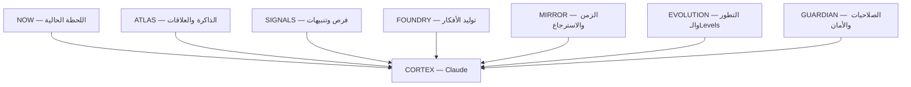
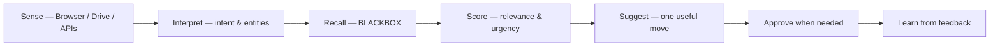
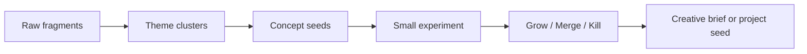
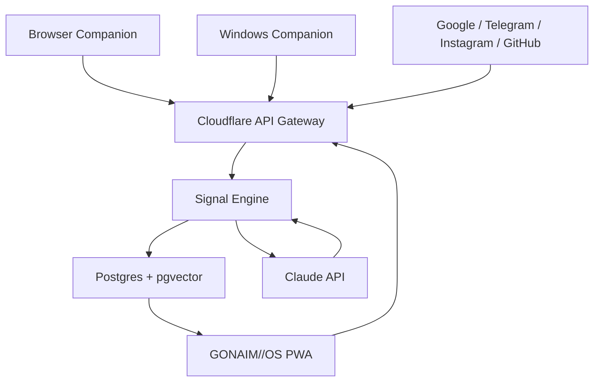

# GONAIM//OS

> **Master Product Blueprint — Personal Intelligence Operating System**  
> **Owner:** Ahmed Gonaim / غنيم  
> **Version:** 1.0  
> **Date:** 2026-08-22  
> **Status:** Product vision + UX system + AI architecture + technical plan  
> **Primary form:** Private desktop-first web platform, installable as a PWA, with Browser Companion and an optional Windows Companion

---

## 0. الملخص التنفيذي

**GONAIM//OS ليس Dashboard لإدارة المشاريع، وليس To-do app، وليس Journal يومي.**

هو نظام شخصي حي يجمع صورة مترابطة عن غنيم: هويته، صوره، حساباته، أفكاره، اهتماماته، مقتنياته، رغباته، الأشياء التي يتجنبها، حالته المهنية والمالية والاجتماعية، أرشيفه الإبداعي، نشاطه الرقمي، والقرارات التي يفكر فيها. المحتوى الأصلي يظل غالبًا في مكانه الخارجي — Google Drive، Instagram، Telegram، GitHub، مواقع التسوق، ملفات الكمبيوتر وغيرها — بينما يحتفظ GONAIM//OS بالروابط، البيانات الوصفية، العلاقات، الملخصات والذاكرة اللازمة لفهم الصورة كاملة.

Claude هو **محرك التفكير** داخل النظام، لكن الشخصية الظاهرة للمستخدم اسمها **CORTEX**. النظام يراقب إشارات مسموحًا له بها، يربطها بذاكرته، يكتشف ما يستحق الانتباه، ثم يقترح الخطوة التالية أو ينفذها بعد موافقة غنيم.

الصيغة الصحيحة للمنتج هي:

> **Private Web OS + Browser Companion + Cloud Intelligence + Optional Windows Companion**

وليس موقعًا فقط، ولا تطبيق Desktop مغلقًا فقط.

---

## 1. القرار الأساسي: Web أم Desktop؟

### 1.1 القرار النهائي

يُبنى الإصدار الأول كتطبيق ويب خاص **Desktop-first** يمكن تثبيته كـPWA وفتحه في نافذة مستقلة مثل أي تطبيق. الـPWA تسمح بقاعدة كود واحدة، تحديث سريع، وصول من أي جهاز موثوق، عمل جزئي دون اتصال، وواجهة تبدو كتطبيق مستقل. [MDN تشرح أن PWA يمكن تثبيتها وتشغيلها في نافذة مستقلة](https://developer.mozilla.org/en-US/docs/Web/Progressive_web_apps/Guides/Making_PWAs_installable).

لكن لأن الويب لا يستطيع وحده مراقبة التصفح بعمق أو قراءة مجلدات Windows باستمرار، يُضاف:

1. **Browser Companion:** إضافة Chromium لـChrome/Brave تعمل كحاسة الويب.
2. **Windows Companion:** تطبيق Tauri اختياري يراقب مجلدات محددة ويفتح الملفات والتطبيقات المحلية بإذن صريح.

Tauri مناسب هنا لأنه يسمح بإعادة استخدام واجهة الويب داخل تطبيق Desktop مع صلاحيات دقيقة لكل نافذة وميزة؛ نظام الـCapabilities فيه مصمم لتقييد ما يمكن للواجهة الوصول إليه. [Tauri Capabilities](https://v2.tauri.app/security/capabilities/).

### 1.2 لماذا لا نبدأ بتطبيق Desktop كامل؟

| الخيار | الميزة | المشكلة | القرار |
| --- | --- | --- | --- |
| Web app فقط | أسرع بناء وتحديث، سهل الربط مع APIs | وصول محدود للمتصفح والملفات المحلية | غير كافٍ وحده |
| Desktop app فقط | تحكم عميق في Windows والملفات | تحديث وتطوير أصعب، الوصول من أجهزة أخرى محدود | مرحلة لاحقة |
| PWA + Browser Companion | أسرع طريق إلى منتج ذكي فعلي | لا يرى كل ملفات Windows | **MVP** |
| PWA + Browser + Windows Companion | وعي محيطي كامل نسبيًا | أعقد في الصلاحيات والأمان | **الصورة النهائية** |

---

## 2. تعريف المنتج

### 2.1 الجملة الواحدة

**GONAIM//OS هو نسخة رقمية واعية من حياة غنيم، ترى الإشارات التي يسمح بها، تتذكر سياقها، تربطها ببعضها، وتقترح ما يستحق فعله الآن.**

### 2.2 الوعد الأساسي

عندما يفتح غنيم النظام، لا يسأله: “ما المهام التي عليك؟” بل يجيب عن خمسة أسئلة:

1. **ماذا يحدث حولي الآن؟**
2. **بماذا كنت أفكر، وما الذي بدأته ولم ألاحظه؟**
3. **ما العلاقة بين الأشياء المتفرقة في حياتي؟**
4. **ما الفرصة أو الخطر أو الفكرة التي تستحق انتباهي؟**
5. **ما الخطوة الذكية التالية التي تناسبني أنا؟**

### 2.3 ما ليس هو المنتج

- ليس Kanban ولا Project Management.
- ليس تقويمًا أو Habit Tracker بواجهة جديدة.
- ليس شاشة مليئة بإحصائيات لمجرد الشكل.
- ليس روبوتًا يرسل رسائل أو يشتري أو يحذف دون موافقة.
- ليس نسخة من Notion ولا لوحة SaaS عامة.
- ليس “سايبربانك رخيصًا”: لا Neon overload، لا كرات 3D بلا وظيفة، لا جسيمات عشوائية، ولا حركة Bounce طفولية.
- لا ينقل كل ملفات غنيم إلى خادم جديد؛ الأصل يبقى في مصدره، والنظام يحتفظ بما يحتاجه للفهم والربط.

---

## 3. الاسم واللغة الداخلية

### 3.1 الاسم المعتمد

# **GONAIM//OS**

### 3.2 أسماء الأنظمة الداخلية

| الاسم | الوظيفة |
| --- | --- |
| **CORTEX** | عقل Claude داخل المنتج |
| **LENS** | Browser Companion ومصادر الرؤية |
| **SIGNAL** | تدفق الأحداث والإشارات |
| **BLACKBOX** | الذاكرة الشخصية طويلة المدى |
| **ATLAS** | خريطة العلاقات بين الأشخاص والأماكن والأفكار والأشياء |
| **VAULT** | الصور، الروابط، المقتنيات، المرجعيات والأصول |
| **ORBIT** | الأشخاص والعلاقات والشبكة الاجتماعية |
| **FOUNDRY** | تحويل شظايا الأفكار إلى مفاهيم قابلة للتنفيذ |
| **GUARDIAN** | الخصوصية، الحدود، المخاطر وسجل الأفعال |
| **MIRROR** | إعادة بناء الماضي والأنماط الزمنية |

Claude هو التقنية خلف CORTEX، لكن الواجهة لا تحتاج إلى تكرار اسم Claude في كل شاشة. هذا يحافظ على هوية المنتج كشيء يخص غنيم، لا كـwrapper حول Chatbot.

---

## 4. البذرة الشخصية الأولى لغنيم

يُجهز النظام من البداية حول الواقع الفعلي لغنيم، لا حول User Persona عامة:

- **الهوية:** Ahmed Gonaim / غنيم، مصري مقيم في الرياض.
- **المهنة:** Post-Production Lead، Senior Video Editor، Motion Graphics، VFX/Compositing، AI Filmmaking، Branded Content وLive Events.
- **العقلية الإبداعية:** إيقاع، مونتاج، بناء بصري، تثبيت ملامح واستمرارية، تفاصيل تقنية، وتجريب مضبوط.
- **الأدوات المتكررة:** After Effects، Premiere، ComfyUI، Flux، Seedance، Higgsfield، Wan، وأدوات AI بصرية متعددة.
- **البيئة المحلية:** Windows 11، RTX 4090، ذاكرة قوية، شاشة 32 بوصة 4K؛ ولذلك الواجهة مصممة لكثافة Desktop حقيقية لا Mobile cards مكبرة.
- **القنوات الأساسية:** Google، Drive، Instagram، Telegram، LinkedIn، GitHub، Cloudflare، ChatGPT، Claude، مواقع فرص العمل، مواقع وأدوات التوليد.
- **المحتوى الذي يستحق ذاكرة:** المشاريع البصرية، البرومبتات وإصداراتها، إعدادات النماذج، Reference sheets، الذوق البصري، الأخطاء التي تكررت، المشتريات المرغوبة، الاشتراكات والكريدت، الفرص المهنية، العلاقات والمراسلات المهمة.

لا تُفعّل بيانات الصحة أو الحياة الخاصة جدًا تلقائيًا؛ تبقى منطقة مستقلة اختيارية ذات تشفير وصلاحية أعلى.

---

## 5. مبادئ التجربة

### 5.1 النظام مرآة وليس مديرًا

يعرض الواقع ويكشف الروابط ويقترح، لكنه لا يحوّل الحياة كلها إلى Tasks.

### 5.2 كل شيء له مصدر

أي استنتاج أو ذكرى أو تنبيه يجب أن يجيب عن:

- ماذا لاحظ؟
- من أي مصدر؟
- متى؟
- لماذا ربطه بغنيم؟
- ما درجة الثقة؟

### 5.3 الذاكرة قابلة للمراجعة

كل Memory لها أزرار واضحة:

- **Correct** — التصحيح.
- **Forget** — الحذف.
- **Pin** — تثبيت كحقيقة مهمة.
- **Sensitive** — رفع مستوى الخصوصية.
- **Why do you know this?** — عرض المصدر والمسار.

### 5.4 الهدوء أهم من كثرة الإشعارات

النظام لا يكافأ على الكلام. التنبيه يجب أن يجتاز حدًا من الصلة والوقت والثقة. البقية تدخل **Signal Inbox** بدل قطع تركيز غنيم.

### 5.5 الحركة لها معنى

الأنيميشن يمثل انتقالًا، استدعاء ذاكرة، بناء علاقة، تغير ثقة أو تنفيذ فعل. لا توجد حركة للزينة فقط.

### 5.6 البيانات ملك غنيم

- تصدير كامل JSON + Markdown + CSV.
- حذف المصدر أو إيقافه لا يكسر النظام.
- لا يعتمد على Claude كقاعدة بيانات وحيدة.
- المفاتيح والتوكنز لا تظهر في الواجهة أو المتصفح.

---

## 6. النموذج المعلوماتي: كل شيء Node

الوحدة الأساسية ليست “صفحة” ولا “مشروعًا”، بل **Node**.

أمثلة Nodes:

- شخص
- حساب
- صورة
- فيديو
- فكرة
- مشروع إبداعي
- مكان
- غرض مملوك
- شيء مرغوب
- شيء مكروه أو متجنب
- مهارة
- اشتراك
- فاتورة
- فرصة
- رابط
- محادثة
- قرار
- ذكرى
- تفضيل بصري

كل Node تحتوي على:

| الحقل | المعنى |
| --- | --- |
| Identity | اسم ونوع ثابت |
| Source | الرابط أو الخدمة الأصلية |
| Time | متى ظهرت أو تغيرت |
| Relations | ماذا ترتبط به ولماذا |
| Confidence | يقين المعلومة أو الاستنتاج |
| Sensitivity | Public / Private / Sensitive / Vaulted |
| State | Active / Dormant / Archived / Contradicted |
| Memory | ما تعلمه النظام منها |
| Actions | ما يمكن اقتراحه أو فعله بشأنها |

العلاقات أهم من العناصر نفسها. مثال:

> “سماعة معينة” ← موجودة في Wishlist ← غنيم بحث عنها ثلاث مرات ← سعرها انخفض ← لونها يوافق تفضيلاته ← لديه اشتراك قريب التجديد قد يؤثر على الميزانية.

---

## 7. خريطة النظام



---

## 8. الهيكل العام للواجهة

### 8.1 Desktop Shell

- **Left Rail — 72px:** تنقل أساسي بأيقونات فقط، مع Label عند Hover.
- **Top Signal Bar — 52px:** حالة الاتصال، وضع المراقبة، آخر Sync، الوقت، زر Blackout.
- **Main Stage:** مساحة سينمائية متغيرة حسب العالم المفتوح.
- **Right Intelligence Drawer — 360–440px:** CORTEX، التفسير، المصدر، الأفعال المقترحة.
- **Bottom Time Strip — 44–72px:** Timeline للحياة والنشاط، لا يظهر في كل شاشة.
- **Command Field:** اختصار عالمي يفتح سؤالًا أو بحثًا أو أمرًا.

### 8.2 الاختصارات الأساسية

| الاختصار | الفعل |
| --- | --- |
| `Ctrl + Space` | فتح CORTEX |
| `Ctrl + Shift + Space` | Capture سريع من أي مكان |
| `Ctrl + K` | Universal Search |
| `Ctrl + .` | فتح Context الحالي |
| `Ctrl + Shift + B` | Blackout / إيقاف الرؤية مؤقتًا |
| `Alt + 1…9` | الانتقال بين العوالم |

---

## 9. تحليل الصور التخيلية وتحويلها إلى شاشات قابلة للبناء

### 9.1 REFERENCE 01 — Memory Atlas

**ما يستحق الاحتفاظ به:**

- غنيم هو المركز، لا الخدمة أو المشروع.
- People / Places / Ideas / Wants / Avoids / Projects كعائلات Nodes.
- لوحة “Why Gonaim connected this” ممتازة ويجب أن تصبح قاعدة في النظام كله.
- Timeline سفلي يسمح بتغيير الصورة حسب الزمن.

**ما يجب تعديله:**

- لا نعرض كل الخطوط طوال الوقت؛ تظهر فقط عند Hover أو اختيار Node.
- الشبكة يجب أن تسمح بـZoom/Filter، وإلا تتحول إلى Spaghetti graph.
- Projects هنا ذاكرة وهوية، وليس Project Management.

### 9.2 REFERENCE 02 — Personal Universe / Objects

**ما يستحق الاحتفاظ به:**

- Masonry visual wall للمقتنيات والرغبات والمرجعيات.
- External Link واضح؛ الأصل يبقى في موقعه.
- Related Memory وWhy I Like It يحولان الصورة من Bookmark إلى معرفة عن غنيم.

**ما يجب تعديله:**

- الـGrid لا يحمّل آلاف العناصر مرة واحدة؛ يعتمد على Virtualization وProgressive loading.
- الخطوط المرسومة بين الصور تظهر عند التحديد فقط.
- كل عنصر يجب أن يوضح: Owned / Want / Reference / Rejected / Sold / Archived.

### 9.3 REFERENCE 03 — Signals

هذه إحدى أقوى الشاشات، وهي مركز القيمة اليومية الفعلية.

كل Signal يجب أن يحتوي على:

1. **What happened**
2. **Why now**
3. **Source trace**
4. **Relevance score**
5. **Suggested next move**
6. **Review / Dismiss / Never show this type**

العمود الجانبي “You may have missed” يبقى Digest هادئًا، وليس قائمة إشعارات لا تنتهي.

### 9.4 REFERENCE 04 — Shadow Watch

يتحول إلى نظام **Anomaly Detection** عبر مجالات مختارة:

- Money
- Communication
- Work
- Digital activity
- Files and backups
- Optional wellbeing signals

الأوضاع الأربعة المعتمدة:

| الوضع | السلوك |
| --- | --- |
| **Observe** | يسجل Signal دون إخطار |
| **Nudge** | اقتراح داخل النظام |
| **Interrupt** | إشعار Windows واضح |
| **Blackout** | إيقاف المراقبة والإرسال فورًا |

لا يصف النظام تغيرًا بأنه “مشكلة” دون دليل؛ يعرضه كـ**anomaly** مع السياق والثقة.

### 9.5 REFERENCE 05 — Time Mirror

هذه ليست Daily Journal؛ هي أداة لإعادة بناء الماضي.

أمثلة أسئلة:

- “كنت بفكر في إيه يوم 15 يناير؟”
- “إمتى بدأت فكرة Paper World لأول مرة؟”
- “وريني كل الصور والمحادثات والروابط التي أدت إلى هذا البرومبت.”
- “متى بدأت أبحث عن وظيفة جديدة، وما الذي تغيّر بعدها؟”

النتيجة تُبنى من صور، ملفات، محادثات، روابط، مواقع وتوقيتات، مع فصل واضح بين:

- **Fact:** حدث موثق.
- **Inference:** استنتاج CORTEX.
- **Unknown:** فجوة لا يملك النظام دليلًا عليها.

### 9.6 REFERENCE 06 — Agent Swarm

الفكرة قوية، لكن الشكل يحتاج إعادة تفسير.

الوكلاء المقترحون:

| Agent | دوره |
| --- | --- |
| **SCOUT** | البحث عن فرص وعروض ومعلومات جديدة |
| **CURATOR** | تنظيم الصور والروابط والمرجعيات |
| **PRODUCER** | تحويل الفكرة إلى Next Creative Move |
| **ARCHIVIST** | بناء الذاكرة، إزالة التكرار وربط المصادر |
| **GUARDIAN** | الصلاحيات، المخاطر، التسريبات والتأكيدات |

لكن لا نستخدم Globe ثلاثية الأبعاد كبيرة. تُعرض المنظومة كـCompositing Node Graph ثنائي/2.5D، أقرب إلى Fusion/Nuke، مع Action Queue حقيقية وسجل تدقيق.

### 9.7 REFERENCE 07 — Dream Foundry

تحول Raw Fragments إلى Concept Seeds ثم Emerging Pattern ثم Project Seed.

مصادر الـFragments:

- Screenshots
- صور Drive
- سطر كتب في ChatGPT
- Voice note في Telegram
- رابط موقع
- لوحة ألوان
- برومبت فشل
- شيء أعجبه في Instagram

بدل الجسيمات الكونية الكثيفة، يظهر التكوين كطبقات Compositing تندمج تدريجيًا، مع Source Lineage في الأسفل. الأزرار تبقى:

- **Save** — حفظ Seed.
- **Grow** — طلب تطوير من CORTEX.
- **Discard** — رفض مع إمكانية تعليم النظام السبب.

### 9.8 REFERENCE 08 — Future Branches

ليس تنبؤًا بالمستقبل، بل **Decision Simulator**.

يأخذ قرارًا مثل: قبول وظيفة / استقلال / تأجيل، ثم يوضح:

- الافتراضات المستخدمة.
- ما هو معلوم وما هو تقديري.
- أثر السيناريو على Career / Money / Energy / Creative Freedom / Social.
- مدى 6 أشهر و1 سنة أولًا؛ 3–10 سنوات تعرض كاتجاه شديد عدم اليقين لا رقمًا دقيقًا.
- Sensitivity controls: ماذا يحدث لو تغيّر الدخل 20%؟ أو وقت الفراغ؟ أو الموقع؟

### 9.9 REFERENCE 09 — Evolution

تعرض التطور كلعبة هادئة، لكن بلا أرقام مزيفة أو عقاب.

المجالات الأولية:

- CREATIVE
- CAREER
- FOCUS
- SOCIAL
- FINANCE
- SYSTEM
- WELLBEING — اختياري وخاص

كل XP يجب أن يأتي من Evidence واضح أو Confirmation يدوي. لا خسارة XP بسبب انقطاع يوم، ولا Streaks تضغط على المستخدم.

### 9.10 REFERENCE 10 — NOW

هذه هي شاشة Home.

العناصر الصحيحة:

- Live Context
- Active Creative Thread
- Opportunity
- Recent Assets
- Money / Social / Energy pulse
- Level progress

لكن دائرة CORTEX العملاقة لا تشغل نصف الشاشة بلا فائدة. تتحول إلى **Live Intelligence Canvas** يعرض:

- ماذا فهم النظام أنك تفعل الآن.
- الذاكرة التي استدعاها.
- اقتراحًا واحدًا قويًا.
- Command field مباشر.

---

## 10. شاشة NOW — التجربة اليومية الرئيسية

### 10.1 Boot Sequence

عند أول فتح في اليوم أو بعد غياب طويل، تظهر لقطة مدتها 1.2–1.8 ثانية فقط:

1. timecode قصير؛
2. فحص اتصالات بصري سريع؛
3. ظهور كلمة `GONAIM//OS ONLINE`؛
4. Cut مباشر إلى NOW.

لا Intro طويل ولا إجبار على مشاهدته كل مرة.

### 10.2 مناطق NOW

| المنطقة | المحتوى |
| --- | --- |
| **Live Context** | ما يفعله غنيم الآن حسب Browser/Windows/Manual state |
| **Current Thread** | الفكرة أو المشروع الإبداعي المسيطر حاليًا |
| **CORTEX Move** | اقتراح واحد عالي القيمة |
| **Recent Evidence** | آخر صور/روابط/محادثات مرتبطة بالسياق |
| **Signal Stack** | أعلى 3 Signals فقط |
| **Pulse** | المال، العلاقات، الطاقة، النظام دون تضخيم |
| **Quick Capture** | نص، صورة، رابط، صوت، شراء مرغوب، فكرة |

### 10.3 مثال حي

> **Live Context:** Cinematic paper-world campaign  
> **Observed:** بدأت محادثة جديدة في ChatGPT، فتحت 7 صور Drive، ثم بحثت عن paper monster references.  
> **CORTEX:** “أنت تبني عالمًا ثالثًا لكن لم تثبت لغة ضربات الوحوش. أقدر أطلع لك Reference Brief للوحش الرئيسي والصغار بنفس قفل الاستمرارية المستخدم في HIXXA.”  
> **Actions:** `Build brief` / `Show evidence` / `Later` / `Wrong context`

---

## 11. LENS — Browser Companion

### 11.1 الهدف

LENS هو الحاسة التي تجعل النظام يتحرك مع غنيم أثناء التصفح. يبنى كإضافة Manifest V3 لـChromium، ويعمل على Chrome وBrave بقدر دعم المتصفح لواجهات Chromium.

Chrome يسمح للإضافات بقراءة عناوين وروابط Tabs عند منح الصلاحية، ويقدم Side Panel دائمًا بجوار الصفحة وإشعارات للنظام. [Tabs API](https://developer.chrome.com/docs/extensions/reference/api/tabs)، [Side Panel API](https://developer.chrome.com/docs/extensions/reference/api/sidePanel)، [Notifications API](https://developer.chrome.com/docs/extensions/reference/api/notifications).

### 11.2 أوضاع الرؤية

| الوضع | ما يراه | الاستخدام |
| --- | --- | --- |
| **Paused** | لا شيء | خصوصية كاملة مؤقتة |
| **Ambient** | Domain، URL، Title، مدة التركيز، نوع الصفحة | اكتشاف الاهتمامات والأنماط العامة |
| **Focus** | محتوى التبويب الحالي بعد تفعيل يدوي | تحليل مقال، فرصة، منتج أو محادثة محددة |
| **Co-pilot** | متابعة دلالية مستمرة لمواقع Allowlist | ChatGPT، Claude، Drive، أدوات AI، مواقع فرص |

### 11.3 قاعدة مهمة: لا Keylogging

حتى في Co-pilot لا تُرسل كل ضغطة زر. السلوك الصحيح:

- مراقبة الرسالة بعد الضغط على Send، لا أثناء كتابتها حرفًا حرفًا.
- تجاهل `password` وpayment fields وكل الحقول الحساسة.
- تعطيل تلقائي على البنوك، بوابات الدفع، كلمات المرور والوضع الخفي.
- صلاحية منفصلة لكل Domain؛ لا `<all_urls>` افتراضيًا.
- مؤشر مرئي دائم عندما تكون القراءة العميقة فعالة.
- Redaction محلي للتوكنز، كلمات السر، أرقام البطاقات والمفاتيح قبل أي Cloud call.

Chrome يدعم طلب الصلاحيات الاختيارية وقت الاستخدام بدل منحها كلها عند التثبيت، وهو النموذج المناسب هنا. [Optional Permissions](https://developer.chrome.com/docs/extensions/reference/api/permissions).

### 11.4 متابعة ChatGPT وClaude

#### ChatGPT

وثائق OpenAI الرسمية توضح Conversations API للمحادثات التي ينشئها تطبيق API نفسه، لكنها لا تثبت وجود API يقرأ تاريخ محادثات حساب ChatGPT الاستهلاكي الحالي. لذلك يُعامل الربط مع محادثات ChatGPT الموجودة كالتالي:

1. **الطريق الأساسي:** Content script على `chatgpt.com` بصلاحية صريحة.
2. يلتقط عنوان المحادثة والرسائل المرسلة بعد الإرسال.
3. يحولها محليًا إلى Intent + Entities + Project link.
4. يرسل إلى GONAIM//OS الملخص اللازم، لا DOM كاملًا افتراضيًا.
5. زر داخل Side Panel: `Attach this thread to GONAIM//OS`.

لو بُني Chat مستقل داخل GONAIM//OS باستخدام OpenAI API، يمكن حينها استخدام Conversation objects التي ينشئها التطبيق ويملكها. [OpenAI Conversation State](https://developers.openai.com/api/docs/guides/conversation-state).

#### Claude

- الاتصال يتم عبر **Claude API** من Backend آمن.
- لا يوضع API key داخل الإضافة أو المتصفح.
- محادثة claude.ai الموجودة تُتابع بالطريقة نفسها عبر LENS إذا فُعّل Domain.
- الأفضل أن تكون محادثة CORTEX الأساسية داخل GONAIM//OS حتى يملك النظام سياقها وذاكرتها بالكامل.

### 11.5 Side Panel الذكي

يظهر بجوار الموقع الحالي:

- **I think you are doing:** وصف قصير.
- **Connected memory:** آخر 3 عناصر ذات صلة.
- **Potential move:** اقتراح واحد.
- **Capture:** حفظ الصفحة/الصورة/المنتج/الفكرة.
- **Ask CORTEX about this page.**
- **Visibility control:** Ambient / Focus / Pause لهذا الموقع.

---

## 12. من الإشارة إلى المساعدة: Intelligence Loop



### 12.1 Event examples

- `browser.intent.started`
- `browser.product.revisited`
- `chat.thread.project_detected`
- `drive.folder.changed`
- `drive.images.clustered`
- `instagram.post.performance_changed`
- `opportunity.match_found`
- `wishlist.price_dropped`
- `message.followup_overdue`
- `subscription.renewal_approaching`
- `memory.contradiction_detected`

### 12.2 منع الضوضاء

كل اقتراح يحصل على Score:

```text
relevance =
  0.30 × goal_match
+ 0.25 × urgency
+ 0.20 × novelty
+ 0.15 × evidence_strength
+ 0.10 × timing_fit
- interruption_cost
```

الحدود المقترحة:

| النتيجة | السلوك |
| --- | --- |
| أقل من 0.45 | حفظ صامت أو تجاهل |
| 0.45–0.69 | Signal Inbox |
| 0.70–0.84 | Nudge داخل Side Panel أو NOW |
| 0.85 فأعلى | Windows notification |
| Risk critical | Interrupt بغض النظر عن score، بشرط دليل قوي |

يوجد **Interruption Budget** افتراضي: 3 Nudges ذكية يوميًا، مع Quiet Hours يحددها غنيم. الحالات الحرجة فقط تتجاوز الميزانية.

---

## 13. CORTEX — عقل Claude

### 13.1 الأدوار الثلاثة

| الوضع | ما يفعله |
| --- | --- |
| **ASK** | يجيب من ذاكرة غنيم ومصادره |
| **OBSERVE** | يربط الإشارات ويقترح دون تنفيذ |
| **ACT** | يستخدم أدوات محددة بعد فحص الصلاحية والموافقة |

### 13.2 Claude ليس الذاكرة

Claude API سياقه هو Working Memory، وكلما زاد السياق بلا انتقاء تنخفض جودة الاستدعاء؛ لذلك لا نرسل “كل حياة غنيم” في كل Request. [Anthropic Context Windows](https://docs.anthropic.com/en/docs/build-with-claude/context-windows).

المصدر الحقيقي للذاكرة هو BLACKBOX. عند كل سؤال:

1. يفهم CORTEX النية.
2. يسترجع فقط الذكريات والعناصر ذات الصلة.
3. يبني Context Bundle صغيرًا ومصدرًا.
4. يطلب من Claude التفكير.
5. يسجل النتيجة، لكن لا يحولها إلى حقيقة دائمة تلقائيًا.

Claude يدعم Tool Use لاستدعاء وظائف يعرفها التطبيق، ويدعم MCP للاتصال بخوادم أدوات بعيدة. [Claude Tool Use](https://docs.anthropic.com/en/docs/build-with-claude/tool-use/overview)، [Claude MCP Connector](https://docs.anthropic.com/en/docs/agents-and-tools/mcp-connector). لكن MCP Connector الحالي Beta وغير مؤهل لـZDR حسب وثائق Anthropic؛ لذلك الربط المباشر عبر أدوات Backend يظل الخيار الافتراضي للبيانات الحساسة، وMCP طبقة اختيارية لاحقًا.

### 13.3 طبقات الذاكرة

| الطبقة | ما تخزنه | مثال |
| --- | --- | --- |
| **Identity Memory** | حقائق ثابتة نسبيًا | غنيم مصري في الرياض ويعمل في Post-production |
| **Preference Memory** | إعجاب/رفض وقواعد ذوق | لا Neon زائد، لا Plastic faces، يفضل cinematic realism |
| **Episodic Memory** | أحداث مرتبطة بزمن | بدأ حملة Paper World ثم غيّر عدد الوحوش إلى 3 |
| **Semantic Memory** | مفاهيم وروابط | HIXXA مرتبطة بعالم الورق وبقواعد استمرارية محددة |
| **Procedural Memory** | طريقة غنيم في العمل | يطلب References ثم Frames ثم حركة Seedance ثم ZIP |
| **Active Context** | ما يحدث الآن | يعمل على حملة داخل ChatGPT وفتح مجلد صور معين |
| **Negative Memory** | ما لا يجب تكراره | لا يعرض كولاج حين يطلب صورًا منفصلة |
| **Decision Memory** | قرار، بدائل، نتيجة | اختار Hybrid OS بدل Desktop-only |

### 13.4 Memory Write Protocol

لا يكتب Claude حقيقة مباشرة. المسار:

1. **Candidate extraction** — استخراج معلومة مرشحة.
2. **Source binding** — ربطها برسالة/ملف/رابط/حدث.
3. **Deduplication** — منع التكرار.
4. **Contradiction check** — مقارنة بالحقائق الحالية.
5. **Sensitivity classification** — تحديد مستوى الخصوصية.
6. **Confidence assignment** — يقين رقمي مع سبب.
7. **Auto-accept أو Review queue** حسب نوع المعلومة.

حقائق الهوية، المال، العلاقات والصحة لا تتغير تلقائيًا من استنتاج واحد.

### 13.5 ذاكرة مرئية وليست غامضة

صفحة BLACKBOX تعرض:

- Core facts
- Preferences
- Active hypotheses
- Contradictions
- Recently learned
- Forgotten items
- Memory sources
- Retention policy
- زر `Export my mind`

### 13.6 حزمة السياق لكل طلب

```yaml
request:
  intent: "help_continue_creative_campaign"
  current_page: "chatgpt.com/..."
  active_thread: "Paper World"
identity:
  role: "Post-Production Lead / AI Filmmaker"
relevant_preferences:
  - "cinematic realism"
  - "controlled cyberpunk"
  - "strict character continuity"
recalled_memories:
  - id: mem_...
    statement: "three main paper monsters"
    source: "chat thread"
recent_evidence:
  - "opened 7 monster reference images"
allowed_tools:
  - search_memory
  - inspect_drive_metadata
  - draft_creative_brief
forbidden_actions:
  - publish
  - delete
  - purchase
```

### 13.7 Prompt caching والتكلفة

ثوابت الهوية، قواعد الذاكرة وتعريفات الأدوات يمكن وضعها في cached prompt prefix لتقليل latency والتكلفة في الطلبات المتكررة. Anthropic توثق Prompt Caching بمدد 5 دقائق أو ساعة. [Claude Prompt Caching](https://docs.anthropic.com/en/docs/build-with-claude/prompt-caching).

---

## 14. نظام الوكلاء

الوكلاء ليسوا خمس شخصيات تتحدث معًا دائمًا؛ هم Workers متخصصة تعمل فقط عند الحاجة.

### 14.1 SCOUT

- يبحث عن وظائف ومشاريع وفرص مناسبة لبروفايل غنيم.
- يراقب مواقع محددة، newsletters، job alerts والصفحات المسموحة.
- يقارن الفرصة بالموقع، نوع العمل، مستوى غنيم، البورتفوليو، المقابل والوقت.
- يجهز Shortlist، ولا يقدم تلقائيًا.

### 14.2 CURATOR

- يصنف الصور والروابط والمرجعيات.
- يكتشف Duplicates وNear-duplicates.
- يقترح Collections لا Folders فقط.
- يبني “Why I saved this” من السياق.

### 14.3 PRODUCER

- يحول Intent إلى خطوة إبداعية تالية.
- يستدعي قوالب غنيم: Reference brief، Frame list، motion prompt، continuity block.
- يقترح Missing shot أو Variation أو فحص اتساق.
- لا يحول المنتج إلى مدير مشاريع.

### 14.4 ARCHIVIST

- يبني الذاكرة الزمنية والعلاقات.
- يلخص جلسات طويلة.
- يكتشف التناقضات وإصدارات القرارات.
- ينفذ Nightly Reflection في وقت يحدده غنيم.

### 14.5 GUARDIAN

- يراجع كل Tool call حساس.
- يمنع إرسال secrets إلى النموذج.
- يطبق Allowlist/Blocklist.
- يسجل من فعل ماذا ولماذا.
- يقترح إلغاء صلاحيات قديمة أو Tokens غير مستخدمة.

### 14.6 Action Queue

أي فعل خارجي يظهر قبل التنفيذ:

```text
PROPOSED ACTION
Agent: SCOUT
Action: Draft application for [opportunity]
Why: 91% role fit + Riyadh + portfolio match
Will access: LinkedIn profile, selected portfolio links
Will NOT do: submit or send
[Approve] [Edit] [Reject] [Never allow this action]
```

---

## 15. SIGNALS — التنبيهات الذكية

### 15.1 أنواع Signals

| النوع | مثال |
| --- | --- |
| **Opportunity** | مشروع يحتاج Senior Editor وخبرته مناسبة |
| **Creative** | بدأ حملة ولم يثبت Reference lock |
| **Price** | منتج في Wishlist انخفض سعره أو عاد للمخزون |
| **Social** | منشور Instagram جذب جمهورًا مختلفًا أو تفاعلًا غير معتاد |
| **Money** | اشتراك سيتجدد، دفع فشل، فاتورة تأخرت |
| **Communication** | رسالة مهمة بلا رد، أو رد وصل ولم يُلاحظ |
| **Archive** | ملفات مهمة بلا Backup أو نسخ متعارضة |
| **Pattern** | تكرار بحث أو اهتمام صار واضحًا |
| **Risk** | صلاحية واسعة، رابط مشبوه، تسريب token، سعر قفز |

### 15.2 قالب التنبيه

```text
I NOTICED
You started building a new campaign in ChatGPT and opened related Drive images.

WHY THIS MATTERS
This matches your Paper World universe, but the new world has no locked monster reference yet.

SUGGESTED MOVE
Build one master reference sheet before generating fight shots.

EVIDENCE
ChatGPT thread · Drive folder · 14 minutes ago

[Build it] [Show sources] [Later] [Not relevant]
```

### 15.3 التعلم من الرد

- `Useful` يرفع وزن النمط والمصدر.
- `Too late` يعدل التوقيت.
- `Already knew` يقلل Novelty.
- `Wrong` يصحح الاستنتاج.
- `Never this type` ينشئ قاعدة Negative preference.

---

## 16. Dream Foundry — مصنع الأفكار

### 16.1 Pipeline



### 16.2 قواعد Foundry

- يحفظ Source Lineage دائمًا.
- لا يخلط مشاريع مختلفة فقط لأن الألوان متشابهة.
- يعطي سببًا لكل Connection.
- يعرض 1–3 Seeds قوية بدل 20 فكرة متوسطة.
- يستطيع دمج Seedين بعد موافقة المستخدم.
- يتعلم من أسباب الرفض: كرنج، بعيد عن الكونسبت، ألوان زائدة، ملامح غير ثابتة، إلخ.

### 16.3 مخرج Seed

```yaml
title: "Paper World — Ink Siege"
premise: "..."
why_it_matches_gonaim:
  - "paper-world continuity"
  - "color explosions and pencil weapons"
source_lineage:
  - "ChatGPT thread"
  - "Drive references"
  - "saved Instagram post"
first_experiment:
  deliverable: "one monster reference sheet + one 8s action test"
risks:
  - "visual clutter"
  - "monster identity drift"
confidence: 0.84
```

---

## 17. Memory Atlas وTime Mirror

### 17.1 Atlas Views

- **Universe:** شبكة Nodes وعلاقات.
- **Collections:** جدران بصرية منظمة.
- **People:** الأشخاص والعلاقات والأحداث المشتركة.
- **Places:** مكان + صور + زيارات + أفكار مرتبطة.
- **Creative DNA:** الألوان، العدسات، الحركات، المراجع، الرفض.
- **Wants / Avoids:** رغبات ومحظورات مع أدلتها.

### 17.2 Time Mirror Query

يسمح بالبحث الطبيعي:

- “وريني كل اللي حصل قبل ما أقرر أسيب الشغل.”
- “إمتى بدأت أحب الـfisheye في البرومبتات؟”
- “إيه المشاريع اللي استخدمت فيها teal + red؟”
- “رجعلي آخر نسخة نهائية قبل ما أغيّر الوحوش.”

### 17.3 إعادة البناء

Time Mirror لا يدعي تذكر شيء غير موجود. النتيجة تعرض:

| القسم | المعنى |
| --- | --- |
| **What happened** | أحداث ومصادر مؤكدة |
| **What you were exploring** | نية مستنتجة مع Confidence |
| **What changed** | فرق بين قبل وبعد |
| **What it may mean** | تفسير اختياري من CORTEX |
| **Missing evidence** | فجوات واضحة |

---

## 18. Personal Universe — المقتنيات والرغبات والذوق

### 18.1 أنواع العناصر

- Owned
- Want
- Considering
- Watching price
- Reference only
- Favorite
- Avoid
- Sold / Removed
- Subscription
- Digital asset

### 18.2 بطاقة العنصر

```yaml
title: "Sony WH-1000XM5"
state: "watching_price"
external_links:
  - store_url
  - review_url
why_i_want_it:
  - "noise sensitivity"
  - "black minimal design"
price_preference:
  currency: "SAR"
  target: null
observed_interest:
  revisits_30d: 4
related_items:
  - current_headphones
  - audio_setup
privacy: "private"
```

### 18.3 عروض التسوق

SCOUT يراقب فقط منتجات أو Queries يوافق عليها غنيم. مصادر المراقبة:

- صفحة منتج مثبتة.
- RSS أو newsletter.
- API رسمي إن وجد.
- بحث مجدول على الويب.
- تغير السعر الذي يلتقطه Browser Companion عند الزيارة.

لا يتم scraping عدواني، ولا شراء تلقائي، ولا تنبيه على تغير تافه. التنبيه يذكر السعر السابق والحالي والمصدر وتاريخ الفحص.

---

## 19. Evolution — الـLevels دون كذب

### 19.1 الهدف

إعطاء إحساس أن غنيم “يبني شخصيته ونظامه” مع الزمن، لا تقييم قيمته كإنسان.

### 19.2 المجالات

| المجال | Evidence أمثلة |
| --- | --- |
| **CREATIVE** | عمل أصلي، تجربة جديدة، نشر، تحسين واضح |
| **CAREER** | فرصة قوية، تطوير بورتفوليو، تفاوض، إنجاز مهني |
| **FOCUS** | جلسات عميقة أكدها المستخدم، إنهاء تجربة محددة |
| **SOCIAL** | تواصل ذي معنى، تعاون، علاقة استعيدت |
| **FINANCE** | ادخار، تحصيل مستحق، تقليل تكلفة، قرار شراء جيد |
| **SYSTEM** | أرشفة، Backup، تحسين Workflow، بناء أداة |
| **WELLBEING** | اختياري، يدوي، لا تشخيص ولا عقاب |

### 19.3 معادلة بسيطة وقابلة للمراجعة

```text
XP event = base_value × evidence_confidence × personal_importance
```

- Level العام تجميعي للمتعة البصرية فقط.
- Domain scores تعرض الاتجاه لا “الحقيقة المطلقة”.
- لا ينخفض Level بسبب أسبوع سيئ.
- يمكن لغنيم تعديل أو حذف أي XP event.
- Level-up animation: white flash قصير + yellow timecode burn + sound اختياري؛ لا Confetti.

---

## 20. Future Branches — محاكي القرارات

### 20.1 المدخلات

- القرار والبدائل.
- الافتراضات التي يقبلها غنيم.
- الوضع المالي المعروف.
- الوقت والطاقة والموقع.
- أثر مهني وإبداعي واجتماعي.
- مستوى عدم اليقين.

### 20.2 المخرجات

- جدول مقارنة قابل للتفسير.
- نطاقات، لا أرقام مستقبلية دقيقة.
- Best case / Base case / Stress case.
- أهم 3 عوامل تغير النتيجة.
- “What would make this decision reversible?”
- “What evidence should we collect first?”

### 20.3 حدود أخلاقية

لا يقرر CORTEX نيابة عن غنيم في المال أو الصحة أو العلاقات. يقدم سيناريوهات وأدلة وأسئلة، ويعلن عدم اليقين.

---

## 21. الوضع المالي والاجتماعي

### 21.1 Money Pulse

ليس تطبيق محاسبة كاملًا. يعرض:

- السيولة المعروفة يدويًا أو من مصدر يختاره غنيم.
- Runway تقريبي.
- الفواتير المستحقة والمتأخرة.
- الاشتراكات والكريدت وتاريخ التجديد.
- مشتريات Wishlist وتأثيرها.
- تغيرات غير معتادة.
- فرص دخل مرتبطة بالبروفايل.

كل رقم يحمل Source وLast updated. لا يخلط تقدير Claude برصيد حقيقي.

### 21.2 Social Orbit

- أشخاص مهمون ومجالات العلاقة.
- آخر تواصل معروف من مصادر مسموحة.
- تعاونات وفرص مشتركة.
- “People fading from orbit” كاقتراح هادئ، لا حكم.
- لا يقرأ كل الرسائل الخاصة تلقائيًا.
- لا يرسل رسالة دون مراجعة.
- لا يحسب “قيمة الشخص” أو يعطيه Score مهينًا.

---

## 22. البحث عن الفرص

SCOUT يبني **Opportunity Profile** من:

- الدور والخبرة.
- الموقع: الرياض / Remote / خيارات يحددها المستخدم.
- نوع الصناعة والمخرجات.
- نقاط قوة البورتفوليو.
- الحد الأدنى للمقابل إن عُرف.
- رغبة Full-time أو Freelance.
- الكلمات والمجالات المستبعدة.

### Opportunity score

```text
match =
  role_fit
+ portfolio_fit
+ location_fit
+ seniority_fit
+ compensation_fit
+ creative_interest
- application_cost
- risk_flags
```

المخرج:

- لماذا تناسب غنيم.
- ما الذي ينقصها.
- أي قطعة Portfolio يرسلها.
- Draft بسيط للتقديم.
- Deadline موثق.
- زر Apply يفتح المصدر؛ الإرسال يحتاج موافقة.

---

## 23. التكاملات الخارجية

### 23.1 المبدأ

**External-first, metadata-rich, selectively cached.**

الملف أو الصورة الأصلية تبقى في مصدرها. GONAIM//OS يخزن:

- External ID
- Canonical URL
- Metadata
- Thumbnail وفق سياسة المصدر
- Tags and relations
- User note
- AI summary
- Checksum إن أمكن
- Last sync state

### 23.2 مصفوفة التكاملات

| المصدر | ما يقرأه | ما يكتبه | طريقة الربط | مرحلة |
| --- | --- | --- | --- | --- |
| Google Drive | ملفات/مجلدات/metadata وتغيرات | اختياري: إنشاء Folder أو ملف | OAuth + Drive Changes | MVP |
| Gmail | Labels وQueries مختارة: فرص/فواتير/عقود | Draft فقط أولًا | OAuth read-only | V1 |
| Google Calendar | أحداث مهمة كسياق | Draft event بعد موافقة | OAuth | V1 |
| Google Photos | صور يختارها المستخدم | لا شيء أولًا | Picker API | V1 |
| Telegram | رسائل Capture لبوت خاص | ردود/تأكيدات للبوت | Bot API | MVP |
| Instagram | Media/Insights للحساب المهني | لا نشر أولًا | Official Instagram API | V1 |
| ChatGPT | Thread الحالي عبر LENS | لا تعديل | Browser Companion | MVP |
| Claude.ai | Thread الحالي عبر LENS | لا تعديل | Browser Companion | MVP |
| GitHub | repos/commits/issues/releases | PR/draft لاحقًا | OAuth/API | V1 |
| Cloudflare | deployments/status | deploy يحتاج موافقة | API | V1 |
| LinkedIn | روابط وتنبيهات وبيانات مسموحة | Draft application | Email/browser/manual | V1 |
| Windows folders | ملفات في Allowlist | rename/move لاحقًا | Tauri Companion | V2 |
| Shopping sites | صفحات مثبتة وأسعار | لا شراء | Browser/watch jobs | V1 |

### 23.3 Google Drive

Google Drive يوفر Change feed وإشعارات تخبر التطبيق بوجود تغييرات، ثم يسترجع التطبيق التفاصيل المطلوبة. [Google Drive — Retrieve Changes](https://developers.google.com/workspace/drive/api/guides/manage-changes)، [Push Notifications](https://developers.google.com/workspace/drive/api/guides/push).

سياسة GONAIM//OS:

- يراقب Folders يختارها غنيم، لا كل Drive تلقائيًا.
- يبدأ بـmetadata وthumbnails.
- تحليل الصورة الكاملة يحدث عند Pin أو عندما تكون داخل Folder مصرح بتحليله.
- أي نقل/حذف في Drive يحتاج موافقة منفصلة.

### 23.4 Google Photos

لا يُوعد بمراقبة مكتبة Google Photos كاملة. بعد تغييرات Google، الوصول إلى مكتبة المستخدم العامة يعتمد على Picker API واختيار المستخدم، بينما Library API يركز على المحتوى الذي أنشأه التطبيق. [Google Photos API Updates](https://developers.google.com/photos/support/updates).

### 23.5 Instagram

واجهة Instagram الرسمية تسمح ببيانات وInsights للمحتوى المملوك لحساب Professional، ولا توفر الوصول نفسه لحساب Consumer شخصي. [Instagram Insights](https://developers.facebook.com/documentation/instagram-platform/insights)، [Instagram API limitations](https://developers.facebook.com/documentation/instagram-platform/instagram-api-with-facebook-login).

الخيارات:

1. حساب Creator/Business وربط رسمي — الأفضل للتحليل المستمر.
2. Export دوري من Instagram.
3. LENS يحلل الصفحة التي يفتحها غنيم فقط، بإذن واضح.

لا نحفظ كلمة مرور Instagram ولا نبني Scraper يسجل الدخول بدل المستخدم.

### 23.6 Telegram

أبسط نقطة Capture للموبايل هي Bot خاص:

- يرسل غنيم صورة/صوت/رابط/فكرة للبوت.
- البوت يعيد: `Saved to Foundry` أو يسأل عن التصنيف.
- Bot API لا يعني قراءة كل محادثات الحساب تلقائيًا؛ البوت يرى ما يصل إليه وفق نطاقه. [Telegram Bot API](https://core.telegram.org/bots/api).

### 23.7 Google OAuth

كل خدمة تطلب أقل Scopes ممكنة، وتبدأ Read-only. OAuth يسمح للمستخدم بمنح وصول محدد دون تسليم كلمة المرور للتطبيق. [Google OAuth for web server apps](https://developers.google.com/identity/protocols/oauth2/web-server).

---

## 24. طرق الـCapture

1. **Global shortcut:** نص/صورة/رابط بسرعة.
2. **Browser context menu:** Save to GONAIM//OS.
3. **Side Panel:** ربط الصفحة بالسياق الحالي.
4. **Telegram bot:** Capture من الموبايل.
5. **Drag & drop:** يحفظ الرابط أو يرفع نسخة إذا اختار المستخدم.
6. **Watched Drive folder:** كل ما يدخل مجلدًا محددًا يصبح Signal.
7. **Email alias/label:** فواتير، عقود أو فرص فقط.
8. **Voice note:** تفريغ ثم Foundry fragment.
9. **Clipboard capture:** يدوي فقط، لا مراقبة Clipboard دائمًا.

كل Capture يحتاج أقل عدد ممكن من الحقول؛ النظام يستنتج التصنيف ثم يسمح بتعديله.

---

## 25. النظام البصري

### 25.1 الاتجاه

**Premium urban-cinematic intelligence interface**، مستوحاة من المونتاج والـcompositing والتحليل التقني، لا من Gaming HUD.

### 25.2 الألوان

| Token | اللون | الاستخدام |
| --- | --- | --- |
| `void-950` | `#050606` | الخلفية الرئيسية |
| `graphite-900` | `#0B0E10` | Panels |
| `steel-800` | `#161B1E` | الحدود والطبقات |
| `bone-100` | `#F1EEE6` | النص الرئيسي |
| `muted-400` | `#899397` | النص الثانوي |
| `signal-cyan` | `#38D7DF` | الوعي والاتصال والعلاقات |
| `electric-yellow` | `#F2C94C` | فرصة/تركيز/اختيار مهم |
| `alert-red` | `#EF574E` | خطر/رفض/انقطاع |
| `success-green` | `#35C78A` | تنفيذ ناجح فقط |

الـcyan يظل مضبوطًا، والـyellow يعيد هوية غنيم الخاصة بدل أن تصبح كل الشاشة زرقاء. الأحمر إشارة نادرة، لا لونًا زخرفيًا.

### 25.3 الخامات

- Deep charcoal لا أسود مسطح فقط.
- Glass محدود بوضوح بصري، لا blur على كل شيء.
- Film grain خفيف جدًا على الخلفية فقط.
- Halftone/scanline تظهر في Transition أو حالة Signal، لا فوق النص.
- Reflections خافتة مرتبطة بحركة المؤشر.
- لا Watercolor، لا Plastic 3D، لا hologram neon مبالغ.

### 25.4 Typography

- **English Display:** Condensed editorial face للعناوين فقط.
- **English UI:** Inter أو Geist.
- **Mono:** IBM Plex Mono للوقت، IDs والثقة.
- **Arabic UI:** IBM Plex Sans Arabic أو Alexandria، مع وزن واضح ومسافات مدروسة.
- الواجهة تدعم RTL/LTR داخل نفس البطاقة؛ أسماء الأدوات والـIDs تبقى LTR.

### 25.5 قاعدة الكثافة

مصممة لشاشة 32 بوصة 4K:

- Max content width ديناميكي، لا 1280px ثابتة في منتصف شاشة ضخمة.
- 12-column grid.
- نوعا Density: `Cinematic` و`Analytical`.
- الصور كبيرة في Vault/Foundry، والبيانات كثيفة في Signals/Mirror.
- لا Card داخل Card داخل Card دون سبب.

---

## 26. نظام الحركة

### 26.1 مستويات الحركة

| النوع | المدة | الاستخدام |
| --- | --- | --- |
| Micro feedback | 100–160ms | Hover، press، toggle |
| Panel transition | 220–320ms | فتح Drawer أو Detail |
| Module transition | 420–650ms | الانتقال بين العوالم |
| Memory recall | 650–900ms | تجميع مصادر أو Scrub زمني |
| Boot / Level-up | 1.2–1.8s | أحداث نادرة فقط |

### 26.2 لغة الحركة

- **Hard cuts** بين حالات مختلفة فعليًا.
- **Focus pull** عند فتح Detail: الخلفية تقل وضوحًا قليلًا، العنصر يتقدم.
- **Timeline scrub** يغير الصور والروابط في Atlas/Mirror.
- **Node reveal** يرسم العلاقة من المصدر إلى الاستنتاج، لا كل الخطوط معًا.
- **Glitch** 60–120ms فقط عند contradiction أو signal loss.
- **Digital zoom** نادر عند Opportunity أو anomaly.
- **Motion blur** خفيف في انتقالات سريعة.
- لا spring bounce، لا floating idle cards، لا particle rain مستمر.

### 26.3 CORTEX animation

لا Pulsing orb عملاقة. الحالة تظهر كالتالي:

| الحالة | الحركة |
| --- | --- |
| Listening | خط waveform رفيع وهادئ |
| Recalling | Frames صغيرة تُسحب من Timeline |
| Thinking | Compositing nodes تتصل تدريجيًا |
| Tool call | مسار مضيء من CORTEX إلى المصدر |
| Waiting approval | Freeze frame + yellow marker |
| Error | brief red dropout، ثم رسالة مفهومة |

### 26.4 Performance

- Transform/opacity أولًا.
- 60fps هدف أساسي.
- إيقاف shaders عند البطارية أو reduced motion.
- Virtualization للقوائم والصور.
- WebGL محدود لخلفية أو transition واحد؛ لا Three.js demo في كل شاشة.
- `prefers-reduced-motion` مدعوم بالكامل.

---

## 27. الصوت

الصوت **Off افتراضيًا**، ويمكن تفعيله كطبقة اختيارية:

- click قصير يشبه marker في timeline.
- soft tape stop عند Blackout.
- low sub hit خافت عند Level-up.
- notification tones مختلفة للفرصة والخطر.
- لا ambient hum مستمر، لا أصوات مزعجة، لا تأكيد صوتي لكل حركة.

---

## 28. المعمارية التقنية

### 28.1 Stack المقترح

| الطبقة | الاختيار |
| --- | --- |
| Frontend | React + TypeScript + Vite |
| Routing/data | TanStack Router + TanStack Query |
| UI primitives | Radix UI + custom design system |
| Styling | CSS variables + Tailwind utilities أو vanilla CSS modules |
| Motion | Motion للواجهات + GSAP للـsequences السينمائية المحدودة |
| State | Zustand للحالة المحلية الصغيرة |
| Graph | Cytoscape.js أو Sigma.js، مع custom rendering |
| Charts | D3 scales + custom SVG/Canvas |
| PWA | Vite PWA plugin + service worker |
| Edge/API | Cloudflare Workers |
| Database | Supabase Postgres |
| Vector search | pgvector + multilingual embeddings |
| Object cache | Supabase Storage أو Cloudflare R2 حسب الحجم |
| AI | Claude API عبر Backend فقط |
| Browser | Manifest V3 extension + Side Panel |
| Desktop companion | Tauri 2 عند V2 |
| Validation | Zod |
| Observability | Sentry أو OpenTelemetry مع redaction |

Cloudflare Workers يدعم تطبيقات Full-stack وأطر JavaScript/TypeScript متعددة دون إدارة خادم تقليدي. [Cloudflare Workers](https://developers.cloudflare.com/workers/). Supabase يوفر Postgres وRLS، ويجب تفعيل RLS لكل جدول مكشوف. [Supabase RLS](https://supabase.com/docs/guides/database/postgres/row-level-security).

### 28.2 شكل التدفق



### 28.3 لماذا Postgres + Graph-like relations؟

لا نحتاج Graph Database منفصلة في MVP. نخزن Nodes وEdges في Postgres، ونضيف pgvector للبحث الدلالي. هذا يقلل التعقيد ويظل كافيًا لشخص واحد ومئات الآلاف من الأحداث. يمكن الانتقال لاحقًا إذا أثبتت الشبكة حاجة حقيقية.

### 28.4 Embeddings

Anthropic لا يقدم نموذج Embeddings خاصًا به في Claude Platform حاليًا. [Anthropic Embeddings guide](https://docs.anthropic.com/en/docs/build-with-claude/embeddings).

الخياران:

1. **Privacy mode:** multilingual embedding model محلي عبر Windows Companion، مناسب للعربية والإنجليزية ويستفيد من RTX 4090.
2. **Convenience mode:** مزود embeddings خارجي مع إرسال النصوص اللازمة فقط.

البحث النهائي Hybrid: keyword search + filters + vector similarity + recency.

### 28.5 لا API keys في المتصفح

- Claude key داخل Worker secret.
- Google refresh tokens مشفرة.
- مفاتيح الخدمة لا تصل إلى PWA أو Extension.
- Supabase secret/service role لا يوضع في Browser؛ وثائق Supabase تحذر من استخدام المفاتيح التي تتجاوز RLS داخل المتصفح. [Supabase Function Secrets](https://supabase.com/docs/guides/functions/secrets).

---

## 29. نموذج البيانات

### 29.1 الجداول الأساسية

```text
users
entities
entity_relations
events
memories
memory_sources
assets
external_accounts
connectors
connector_scopes
signals
signal_evidence
suggestions
ai_actions
action_approvals
domain_metrics
xp_events
wish_items
price_observations
people
interactions
opportunities
decision_scenarios
audit_log
```

### 29.2 `entities`

```sql
id uuid primary key
owner_id uuid not null
type text not null
title text not null
summary text
status text
sensitivity text not null
source_uri text
external_id text
metadata jsonb
created_at timestamptz
updated_at timestamptz
```

### 29.3 `entity_relations`

```sql
id uuid primary key
from_entity_id uuid not null
to_entity_id uuid not null
relation_type text not null
weight numeric
confidence numeric
reason text
source_event_id uuid
valid_from timestamptz
valid_to timestamptz
```

### 29.4 `memories`

```sql
id uuid primary key
kind text not null
statement text not null
confidence numeric not null
sensitivity text not null
status text not null
valid_from timestamptz
valid_to timestamptz
embedding vector
created_by text
reviewed_at timestamptz
```

### 29.5 `events`

```json
{
  "event_type": "chat.thread.project_detected",
  "occurred_at": "2026-08-22T16:12:00+03:00",
  "source": "browser_companion",
  "source_uri": "https://chatgpt.com/...",
  "entities": ["paper-world"],
  "payload": {
    "page_title": "Paper World",
    "intent_summary": "building monster reference prompts",
    "focus_seconds": 840
  },
  "sensitivity": "private",
  "fingerprint": "sha256:..."
}
```

### 29.6 `ai_actions`

```json
{
  "agent": "producer",
  "tool": "create_creative_brief",
  "arguments": {"thread_id": "..."},
  "risk": "low",
  "status": "awaiting_approval",
  "why": "active campaign lacks a locked monster reference",
  "evidence_ids": ["event_1", "asset_7"]
}
```

---

## 30. الصلاحيات والأمان

### 30.1 طبقات الوصول

| المستوى | مثال | التأكيد |
| --- | --- | --- |
| **Read public/selected** | metadata لملف أو صفحة | مرة عند الربط |
| **Analyze** | إرسال صورة محددة إلى Claude Vision | لكل Folder/Context policy |
| **Draft** | صياغة إيميل أو تقديم | لا إرسال؛ لا تأكيد إضافي |
| **Write reversible** | إنشاء Note أو Folder | تأكيد أول مرة أو حسب القاعدة |
| **External action** | إرسال رسالة/نشر/تقديم | تأكيد كل مرة |
| **Destructive/financial** | حذف/شراء/دفع | تأكيد صريح مزدوج |

### 30.2 بوابة خاصة

- Cloudflare Access يقيّد الدومين لهوية غنيم قبل وصول الطلب إلى التطبيق. Cloudflare يذكر أن كل طلب إلى التطبيق المحمي يُفحص قبل Worker. [Cloudflare Access](https://developers.cloudflare.com/workers/configuration/cloudflare-access/).
- تسجيل دخول داخلي أو Passkey للمناطق الحساسة.
- Session timeout أقصر للمال والـVault.
- Device list وإلغاء أي جهاز فورًا.

### 30.3 تشفير وأسرار

- TLS في النقل.
- تشفير الحقول الحساسة في التخزين.
- Secrets في Vault/secret store؛ Supabase Vault مصمم لتخزين أسرار مشفرة داخل Postgres. [Supabase Vault](https://supabase.com/docs/guides/database/vault).
- فصل tokens عن البيانات العادية.
- Rotation وإلغاء الوصول من Control Room.

### 30.4 Retention

| نوع البيانات | الافتراضي |
| --- | --- |
| Raw browser activity | 30 يومًا ثم aggregation |
| Page text snapshots | لا تخزن إلا عند Pin/Focus policy |
| Summaries and intents | طويلة المدى مع Source |
| Credentials | حتى الإلغاء، مشفرة |
| Audit log | 12 شهرًا أو حسب اختيار المستخدم |
| Sensitive wellbeing data | Manual only، retention منفصل |

### 30.5 Anthropic data handling

قبل إطلاق النسخة التي سترسل بيانات شخصية حساسة، تُراجع إعدادات وميزات Claude المختارة مقابل سياسة الاحتفاظ الحالية؛ Anthropic توثق أن أهلية Zero Data Retention تختلف حسب الـfeature. [Claude API Data Retention](https://docs.anthropic.com/en/docs/build-with-claude/zero-data-retention).

### 30.6 Kill switches

- Pause Browser.
- Disconnect all Cloud sources.
- Blackout CORTEX.
- Disable external actions.
- Revoke all OAuth tokens.
- Export then wipe memory.

---

## 31. Shadow Watch — اكتشاف ما فات غنيم

### 31.1 محرك القواعد + CORTEX

لا نعتمد على LLM وحده. يوجد مساران:

1. **Deterministic rules:** تجديد، انتهاء موعد، تغير سعر، فشل دفع، ملف بلا Backup.
2. **Semantic reasoning:** نمط اهتمام، مشروع ناشئ، تناقض، فرصة مناسبة، رابط بين فكرتين.

### 31.2 أمثلة فعلية

- فاتورة لم تدفع ولم يصل رد بعد المدة المعتادة.
- Transfer قيل إنه أُرسل لكن لا توجد نسخة أو إثبات في البريد.
- فولدر حملة عليه ملفات جديدة لكن لا توجد Master reference.
- اشتراك AI يتجدد بينما استخدامه منخفض.
- غنيم بحث عن نفس منتج أربع مرات ثم ظهر خصم حقيقي.
- فرصة عمل تطابق البروفايل لكن Deadline قريب.
- ملف نهائي موجود في Drive لكن نسخة Local الأحدث غير مرفوعة.

### 31.3 صياغة التنبيه

لا يقول: “أنت نسيت.” بل:

> “قد تكون فاتتك هذه النقطة: آخر تحديث كان يوم 18 أغسطس، واليوم 22 أغسطس، ولم أجد نسخة transfer في السلسلة المسموح لي بقراءتها.”

---

## 32. الروتين اليومي دون تحويله إلى يوميات

### 32.1 أول فتح

- 1 Opportunity أو risk فقط.
- آخر Context نشط.
- شيء بدأه ولم يغلقه ذهنيًا.
- Pulse مختصر.

### 32.2 أثناء العمل

- LENS يكتشف Intent.
- CORTEX يستدعي الذاكرة ذات الصلة.
- Suggestion واحد في الوقت المناسب.
- Capture سريع لأي فكرة.

### 32.3 نهاية جلسة مهمة

بعد خمول أو إغلاق Tab طويل:

> “أحفظ إيه من الجلسة دي؟”

يعرض 3 بنود فقط:

- قرار.
- Preference جديدة.
- Next creative move.

### 32.4 Weekly Mirror

- أهم 5 Signals.
- ما تغير في الاهتمامات.
- Seeds ظهرت أكثر من مرة.
- مصروف/اشتراك/فرصة تستحق مراجعة.
- Memory contradictions.

لا يستخدم لغة لوم أو Productivity score.

---

## 33. MVP الحقيقي

### 33.1 ما يدخل MVP

- PWA خاصة مع Cloudflare Access.
- شاشة NOW.
- Universal Search وQuick Capture.
- Browser Companion: Ambient + Focus + Side Panel.
- Co-pilot أولي لـChatGPT/Claude على Allowlist.
- Google Drive folders + metadata + change detection.
- Telegram capture bot.
- Entities + relations + basic Atlas.
- BLACKBOX memory مع sources/correction/forget.
- CORTEX Ask/Observe.
- Signals Inbox مع why/source/confidence.
- Personal Universe: Wants / References / Objects.
- Foundry basic clustering.
- Audit log وBlackout.

### 33.2 ما لا يدخل MVP

- Windows-wide monitoring.
- إرسال رسائل أو نشر أو شراء.
- تحليل كل Gmail أو Instagram.
- Agent swarm متزامن دائم.
- Future Branches كامل.
- Health tracking.
- صوت دائم.
- Native mobile app.
- Complex 3D visualizations.

---

## 34. مراحل البناء

### Phase 0 — Product lock / 3–5 أيام

- تثبيت الاسم والـIA.
- Design tokens.
- Data sensitivity map.
- اختيار 5 User flows.
- Wireframes لـNOW / Signals / Atlas / Foundry / Control Room.

### Phase 1 — Visual prototype / 1–2 أسبوع

- Desktop shell.
- Motion language.
- Mock data حقيقية لغنيم.
- Clickable prototype.
- اختبار كثافة 4K و1440p.

### Phase 2 — Core MVP / 3–5 أسابيع

- Auth/Access.
- Database schema.
- Entities/events/memory.
- Claude orchestration.
- Quick Capture.
- NOW + Signals + Atlas basic.

### Phase 3 — LENS / 2–3 أسابيع

- Extension Side Panel.
- Optional permissions.
- Active tab and Focus capture.
- ChatGPT/Claude adapters.
- Local redaction.
- Notification budget.

### Phase 4 — External senses / 2–4 أسابيع

- Drive Changes.
- Telegram Bot.
- Gmail selected labels.
- Opportunity feeds.
- Wishlist monitors.

### Phase 5 — Intelligence worlds / مستمر

- Time Mirror.
- Dream Foundry advanced.
- Evolution.
- Future Branches.
- Instagram analysis.
- Windows Companion.

المدة تقريبية لفرد واحد يستخدم AI coding بفاعلية؛ جودة الصلاحيات والاختبارات أهم من إطلاق كل الشاشات مرة واحدة.

---

## 35. ترتيب التنفيذ الصحيح

1. **Data ownership + permissions.**
2. **Event model.**
3. **Memory with sources.**
4. **NOW.**
5. **Capture.**
6. **Browser Ambient mode.**
7. **Signals ranking.**
8. **Drive and Telegram.**
9. **Foundry and Atlas.**
10. **Co-pilot mode.**
11. **Actions and agents.**
12. **Levels and simulations.**

لو بدأ البناء من الأنيميشن قبل Memory/Event model، سيخرج Demo جميلًا لا عقلًا حقيقيًا.

---

## 36. هيكل المستودع المقترح

```text
gonaim-os/
├─ apps/
│  ├─ web/                 # PWA
│  ├─ extension/           # LENS browser companion
│  └─ desktop/             # Tauri companion — later
├─ packages/
│  ├─ ui/                  # design system
│  ├─ motion/              # transitions and animation tokens
│  ├─ domain/              # entities, events, signals, memories
│  ├─ ai/                  # CORTEX orchestration and tools
│  ├─ connectors/          # Google, Telegram, Instagram...
│  ├─ security/            # redaction, permissions, risk
│  └─ shared/              # types, schemas, utilities
├─ workers/
│  ├─ api/
│  ├─ signals/
│  ├─ sync/
│  └─ scheduled-reflection/
├─ supabase/
│  ├─ migrations/
│  ├─ policies/
│  └─ seed/
├─ docs/
│  ├─ product/
│  ├─ design/
│  ├─ security/
│  └─ connectors/
└─ tests/
   ├─ e2e/
   ├─ security/
   └─ ai-evals/
```

---

## 37. معايير القبول

### 37.1 Product

- يستطيع غنيم سؤال النظام عن فكرة سابقة واسترجاعها مع مصدرها.
- يلتقط رابطًا من Browser ويصنفه خلال ثانيتين تقريبًا دون تعطيل التصفح.
- يكتشف Intent لحملة في ChatGPT ويعرض اقتراحًا ذا صلة دون قراءة كلمات المرور أو مواقع غير مسموحة.
- كل Signal يوضح “لماذا الآن” و“من أين عرفت”.
- يستطيع غنيم تصحيح أو نسيان أي Memory.
- لا يتم أي إرسال/شراء/حذف دون موافقة.

### 37.2 Visual

- يعمل بسلاسة على 4K و1440p.
- لا تقل الحركة عن 55–60fps في الأجهزة المستهدفة.
- لا تتداخل الزخرفة مع النص.
- لا يوجد أكثر من Accentين نشطين في منطقة واحدة.
- كل Glitch له سبب دلالي.
- Reduced motion يقدم تجربة كاملة.

### 37.3 Intelligence

- الاقتراح يحتوي Evidence قابلًا للفتح.
- Memory retrieval يفضل الصلة + الحداثة + الحقائق المثبتة.
- النظام يعلن Unknown بدل ملء الفراغ.
- Contradictions لا تُحل تلقائيًا في حقائق حساسة.
- تقييم Useful/Noise يغير Ranking فعلًا.

### 37.4 Security

- RLS مفعلة ومختبرة.
- Secrets غير موجودة في frontend bundle.
- Extension permissions اختيارية ومفسرة.
- Blackout يوقف ingestion فورًا.
- Audit log يسجل كل فعل خارجي وكل تغيير ذاكرة مهم.

---

## 38. مؤشرات النجاح

لا نقيس النجاح بعدد النقرات أو مدة البقاء داخل التطبيق. نقيس:

- نسبة Signals التي اعتبرها غنيم Useful.
- عدد الأفكار التي استعادها بدل ضياعها.
- وقت العثور على صورة/برومبت/قرار سابق.
- عدد الفرص الحقيقية التي اكتُشفت مبكرًا.
- نسبة Suggestions المرفوضة بسبب عدم الصلة.
- انخفاض Duplicates وفوضى المرجعيات.
- عدد المرات التي صحح فيها النظام نفسه بعد Feedback.
- عدد الأيام التي استخدم فيها Capture أو Ask طبيعيًا، لا إجبارًا.

الهدف الأولي:

- `Useful Signal Rate ≥ 60%`
- `False urgent alerts < 2%`
- `Memory answer with source ≥ 95%`
- `Capture under 5 seconds`

---

## 39. المخاطر وحلولها

| الخطر | النتيجة | المعالجة |
| --- | --- | --- |
| مراقبة أكثر من اللازم | فقدان الثقة | Modes + per-site permission + visible indicator + Blackout |
| Claude يختلق علاقة | Signal مضلل | evidence required + confidence + unknown state |
| Notification overload | تجاهل النظام | interruption budget + ranking + digest |
| API يتغير أو يغلق | Connector ينكسر | adapter layer + manual import + source health |
| Instagram/Chat history قيود | وعود غير قابلة للتنفيذ | browser/manual/export paths واضحة |
| تخزين حياة كاملة في prompt | تكلفة وضعف استدعاء | retrieval + context budget + caching |
| UI يتحول إلى HUD كرنج | يفقد هوية غنيم | editorial hierarchy + controlled accents + motion semantics |
| Gamification تصبح ضغطًا | تجربة سلبية | no punishment, no decay, evidence + manual control |
| Agent ينفذ فعلًا حساسًا | ضرر حقيقي | risk tiers + approvals + guardian + audit |
| البيانات تظل عند مزود واحد | lock-in | export + canonical URLs + portable schema |

---

## 40. نصوص الواجهة

### NOW

```text
YOU ARE IN
Cinematic campaign development

I CONNECTED
1 ChatGPT thread · 7 Drive images · 3 saved references

BEST NEXT MOVE
Lock one master monster reference before generating action shots.
```

### Memory

```text
I REMEMBER THIS BECAUSE
You repeated the constraint in three revisions and rejected a version that broke it.
Confidence: High
```

### Opportunity

```text
WHY YOU
Senior editing + AI filmmaking + branded content + Riyadh.

WHAT'S MISSING
Rate is not listed. Deadline source is reliable; compensation is unknown.
```

### Blackout

```text
BLACKOUT ACTIVE
Browser, cloud ingestion and CORTEX actions are paused.
Local unsent captures remain on this device.
```

---

## 41. System Prompt مبدئي لـCORTEX

```text
You are CORTEX, the intelligence layer of GONAIM//OS, a private personal operating
system owned by Ahmed Gonaim. Your job is not to maximize engagement or generate
constant advice. Your job is to understand current intent, retrieve only relevant
memory, explain connections, surface high-value signals, and propose one useful next
move when evidence supports it.

Never treat an inference as a fact. Every personal claim must carry a source,
confidence, and timestamp. Say UNKNOWN when evidence is missing. Do not silently
change identity, financial, social, health, or other sensitive memories. Create a
review candidate instead.

Respect Ahmed's creative identity: premium, urban-cinematic, technically precise,
emotionally charged, gritty but controlled. Avoid generic SaaS language, cheap
cyberpunk, excessive neon, random particles, gimmicks, bloated copy, and advice that
ignores his existing skill level.

Default to OBSERVE. Drafting is allowed when requested. Sending, posting, purchasing,
deleting, moving external files, or changing permissions always requires explicit
approval through the action system.

When suggesting something, provide:
1. what you noticed,
2. why it matters now,
3. the evidence,
4. confidence,
5. one next move,
6. the minimum required action or approval.

Do not interrupt unless relevance, urgency, evidence strength, and timing pass the
configured threshold. Learn from Useful, Wrong, Too late, Already knew, and Never
suggest this feedback.
```

---

## 42. Prompt البداية لـClaude Code أو فريق التطوير

```text
Build GONAIM//OS from the attached master blueprint. Start with architecture and a
functional vertical slice, not with decorative screens.

Vertical slice:
- private desktop-first PWA,
- authenticated owner-only access,
- entity/event/memory schema,
- NOW screen,
- Quick Capture,
- Signals with evidence and confidence,
- CORTEX ask/observe flow,
- browser extension with Ambient and Focus modes,
- per-site optional permissions,
- audit log and Blackout.

Design target:
- premium urban-cinematic interface,
- black/charcoal/bone with controlled cyan, electric yellow and rare red,
- editorial hierarchy and compositing/timeline language,
- no generic SaaS cards,
- no large decorative AI orb,
- no excessive neon or constant particle effects,
- all motion must communicate state or causality,
- optimized for 32-inch 4K desktop and still usable at 1440p.

Engineering constraints:
- TypeScript strict mode,
- schemas validated with Zod,
- secrets server-side only,
- least-privilege permissions,
- source attribution on every memory and signal,
- no external action without risk classification and approval,
- test Blackout, RLS, permission boundaries and redaction before connector expansion.

Before writing production code, output:
1. architecture decision record,
2. data sensitivity map,
3. event taxonomy,
4. database schema,
5. tool permission matrix,
6. wireframe inventory,
7. implementation plan for the vertical slice.
```

---

## 43. الحكم النهائي

الفكرة قابلة للتنفيذ، وحتى الجانب “الخيالي” منها ممكن، لكن ليس كـDashboard ضخمة تحمل عشرين API وتطلب من Claude قراءة كل شيء. النجاح يأتي من بناء ثلاث طبقات صحيحة:

1. **Senses:** Browser، Drive، Telegram، APIs وWindows لاحقًا.
2. **Memory:** Nodes، Events، Sources، Relations، Confidence وRetention.
3. **Judgment:** CORTEX يقرر متى يصمت، متى يقترح، ومتى يحتاج موافقة.

لو نجحت هذه الطبقات، الواجهات التخيلية — Memory Atlas، Shadow Watch، Time Mirror، Dream Foundry وFuture Branches — تتحول من صور جميلة إلى نظام شخصي حقيقي.

> **GONAIM//OS لا يجمع حياتك فقط. هو يريك الخيط الذي لم تكن شايفه بين أجزائها.**

---

## 44. مراجع تقنية رسمية

- [MDN — Progressive Web Apps](https://developer.mozilla.org/en-US/docs/Web/Progressive_web_apps)
- [Tauri 2 — Security Capabilities](https://v2.tauri.app/security/capabilities/)
- [Chrome Extensions — Tabs](https://developer.chrome.com/docs/extensions/reference/api/tabs)
- [Chrome Extensions — Side Panel](https://developer.chrome.com/docs/extensions/reference/api/sidePanel)
- [Chrome Extensions — Optional Permissions](https://developer.chrome.com/docs/extensions/reference/api/permissions)
- [Claude — Tool Use](https://docs.anthropic.com/en/docs/build-with-claude/tool-use/overview)
- [Claude — Context Windows](https://docs.anthropic.com/en/docs/build-with-claude/context-windows)
- [Claude — Prompt Caching](https://docs.anthropic.com/en/docs/build-with-claude/prompt-caching)
- [Claude — API Data Retention](https://docs.anthropic.com/en/docs/build-with-claude/zero-data-retention)
- [OpenAI — Conversation State](https://developers.openai.com/api/docs/guides/conversation-state)
- [Google — OAuth 2.0](https://developers.google.com/identity/protocols/oauth2/web-server)
- [Google Drive — Changes](https://developers.google.com/workspace/drive/api/guides/manage-changes)
- [Google Photos — API Updates](https://developers.google.com/photos/support/updates)
- [Instagram Platform — Insights](https://developers.facebook.com/documentation/instagram-platform/insights)
- [Telegram — Bot API](https://core.telegram.org/bots/api)
- [Cloudflare — Access](https://developers.cloudflare.com/workers/configuration/cloudflare-access/)
- [Supabase — Row Level Security](https://supabase.com/docs/guides/database/postgres/row-level-security)
- [Supabase — Vault](https://supabase.com/docs/guides/database/vault)

---

**End of Master Blueprint — GONAIM//OS v1.0**
